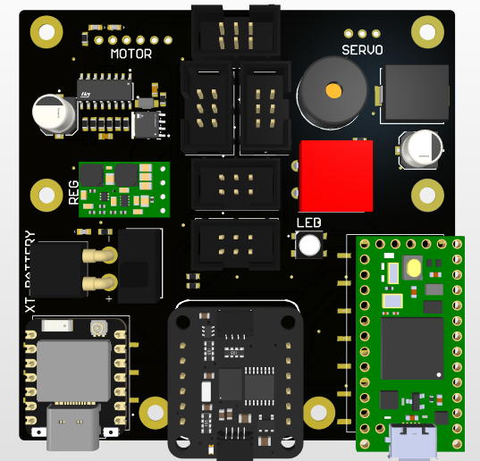
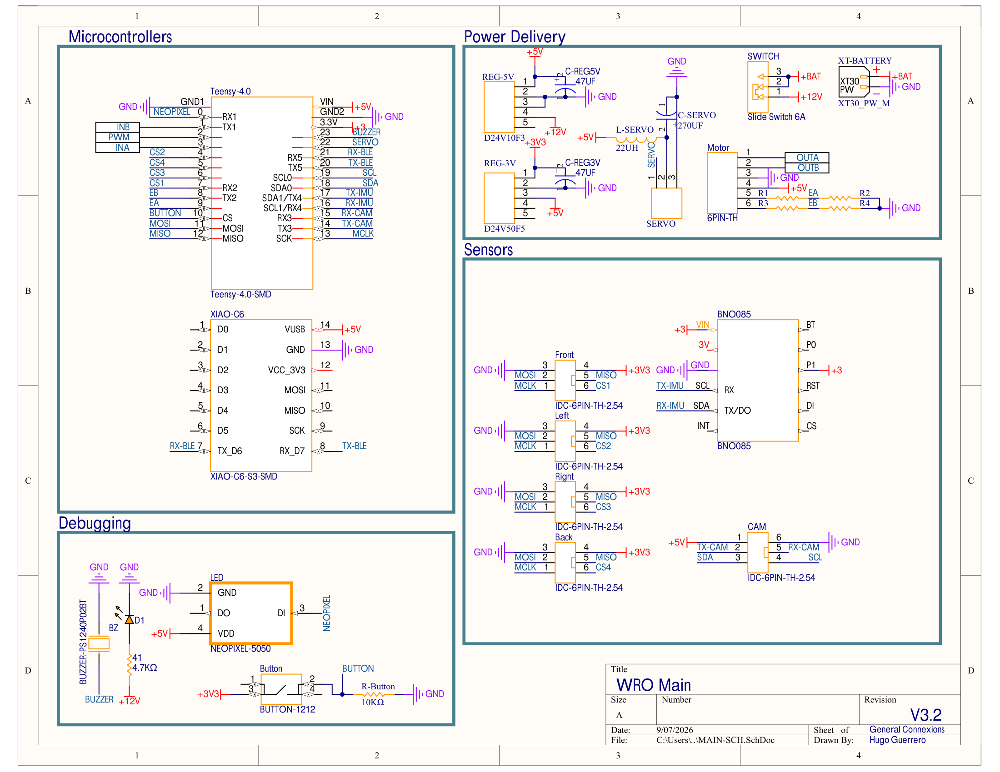
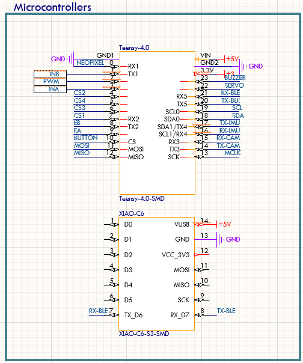
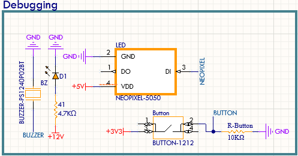
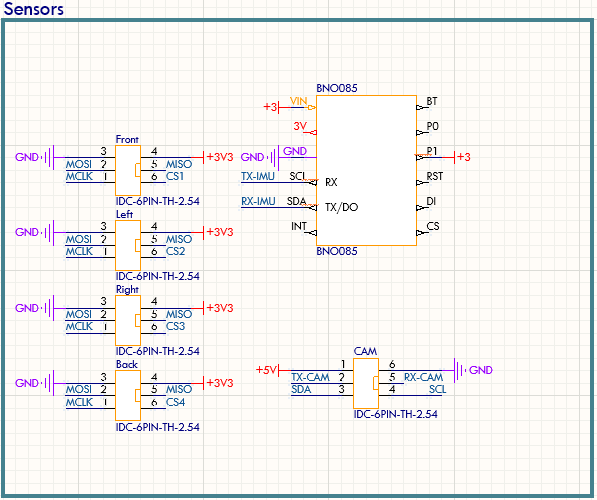
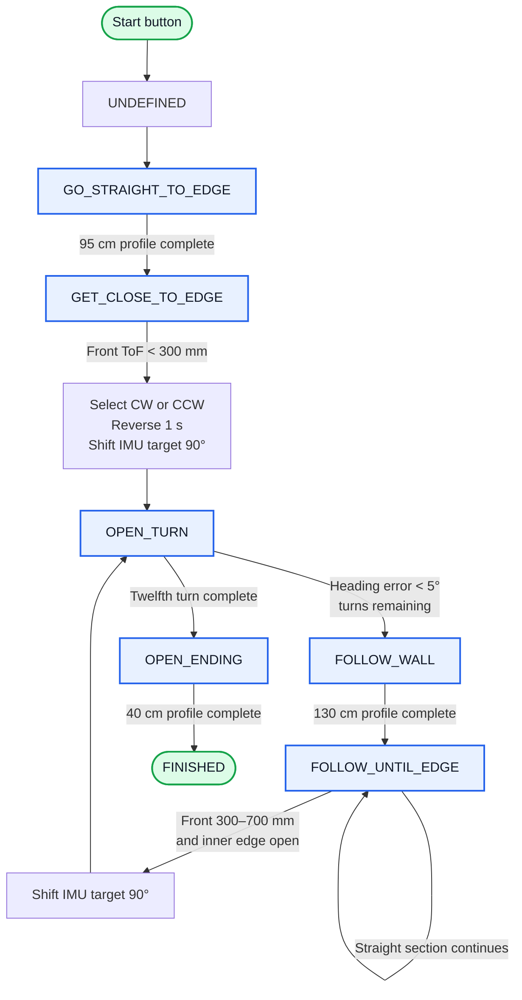
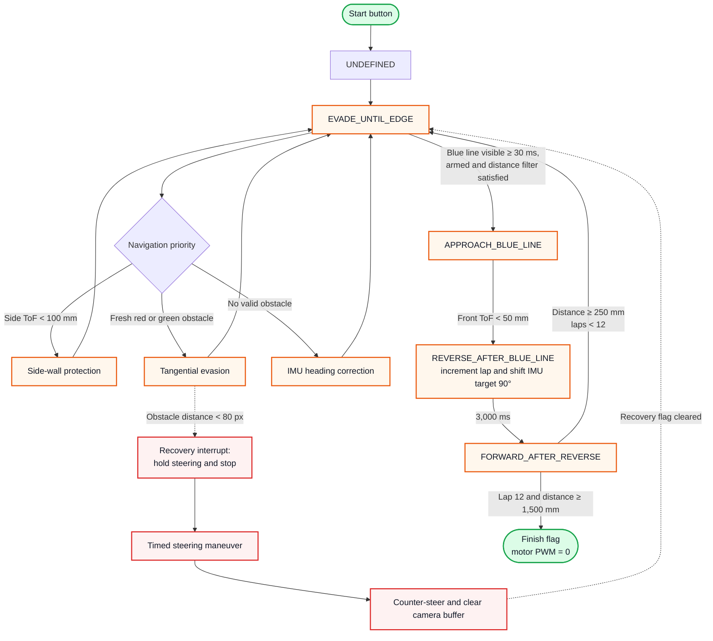

# ChaBots - WRO Future Engineers 2026


<!---->


## Follow us!

<!-- Facebook -->

<a  href="https://www.facebook.com/chabotsMX/">


</a>

<!-- Instagram -->

<a  href="https://www.instagram.com/chabotsmx/"  target="_blank">


</a>

<!-- YouTube -->

<a  href="https://www.youtube.com/@chabotsmx1956/videos"  target="_blank">


</a>


This repository contains the documentation for **ChaBots'** participation in the **WRO Future Engineers 2026** category. Our robot was designed and built by a team of Mexican students passionate about robotics and education.

## Competition Videos <a name="competition-videos"></a>

Watch Pistonudo complete the Open and Obstacles challenges. Select a preview to open the corresponding video on YouTube.

| Open Challenge | Obstacles Challenge |
|:---:|:---:|
| [](https://youtu.be/oslJ-CmbmxM) | [](https://youtu.be/23dmH0szIEk) |
| [▶ Watch Open Challenge](https://youtu.be/oslJ-CmbmxM) | [▶ Watch Obstacles Challenge](https://youtu.be/23dmH0szIEk) |


## 📜 Table of Contents

🎬 [Competition Videos](#competition-videos)

1. 🧑‍💻 [The Team](#the-team)
2. 🎯 [The Challenge](#the-challenge)
3. 🏆 [Lessons from the Previous Season](#experience-from-last-year)
4. 🔬 [Research, Development and Decision Log](#rd)
5. 🤖 [Final Robot Architecture](#robot-overview)
6. ⚙️ [Mobility Management](#mobility-management)
7. 💡 [Power, Electronics and Sensor Management](#electronics)
8. 💻 [Software Architecture and Control](#software-architecture)
9. 🚧 [Obstacle Management](#obstacle-management)
10. 🧪 [Testing, Validation and Results](#testing-validation)
11. 🛠️ [Construction, Serviceability and Debugging](#construction-guide)
12. 💰 [Cost Report](#cost-report)
13. 📚 [Resources](#resources)
14. 📋 [Engineering Development Log](#engineering-log)
15. ©️ [License](#license)
---


## 1. The Team <a name="the-team"></a>

<div  align="center">


</div>

<div  align="center">

<h2  style="color:#1e90ff; font-size:2.2em; margin-top:0.5em; margin-bottom:0.2em;">

<span  style="color:#222; background:linear-gradient(90deg,#1e90ff,#00c3ff,#00ffb3,#1e90ff);-webkit-background-clip:text;-webkit-text-fill-color:transparent;">We are <b>ChaBots Tuneados</b></span> -[:]

</h2>

</div>


### Roy Iván Barrón Martínez

**Age:** 21

**Role:** Captain & Software Designer


I am a self-taught robotics enthusiast with experience in embedded systems, software, and mechanical integration. my team ChaBots Ocelot won Mexico Robocup soccer Open second place and achieved multiple national awards in programming and robotics.


> "I enjoy setting nearly impossible goals to push myself while learning. I believe that learning should always lead to building something real."


---


### Leonardo Villegas López

**Age:** 21

**Role:** Mechanical Designer


I am a Mechatronics Engineering student passionate about technology and innovation. I have been a contestant for eight years, winning various regional and national competitions, and participating internationally.

> "I will take any opportunity to grow"


---


### Hugo Iván Guerrero Díaz

**Age:** 19

**Role:** Electronics Designer

I am a Mechanical Engineering student that has been participating in robotics competitions since 2019. I won at the RoboCup Mexican Open and represented Mexico at the international RoboCup event in Brazil.


> "I miss her."


---


### Diego Vitales Medellín

**Age:** 23

**Role:** Coach


I've been involved in robotics for more than 14 years, working as a programmer on most of the projects in which I have participated. I have had many regional, national, and international experiences. I now share that knowledge to help others develop their skills, reach their goals, and find their passion.


> "I like to face challenges and even more so when it's with more people. Learning and creating something is better when shared."


---


## 2. The Challenge <a name="the-challenge"></a>


The **WRO Future Engineers** challenge pushes students to create fully autonomous self-driving vehicles. Each robot must:


- Navigate a dynamically randomized track

- Detect and avoid colored obstacles (green/red blocks)

- Execute a parallel parking maneuver


Scoring is based on:

- Performance on track

- Obstacle handling

- Documentation quality

- Innovation and engineering rigor


For more information, visit the [WRO official website](https://wro-association.org/).


---


## 3. Lessons from the Previous Season <a name="experience-from-last-year"></a>


### 3.1 What Happened


Last year was an incredible experience. We were able to achieve first place nationally and later reached 36th place at the international competition. Beyond the results, we identified several important issues in our robot. We also took notes on what we observed and discussed with other teams, which gave us valuable information to improve almost every aspect of our design.


### 3.2 Design Philosophy


Our design philosophy has not changed much from last year. Instead, we found better ways to accomplish what we had originally planned.


Historically, in this and other competitions, we have preferred to build a new robot from scratch every year. We believe this is one of the best ways to push ourselves to improve, learn from previous mistakes, and avoid repeating old limitations. Because of that, this remains one of our core design principles.


Our main design goals are:


- Small size

- Reliability

- Avoiding unnecessary overengineering

- Consistency


### 3.3 What Went Wrong


Our robot had three main issues, which affected us mostly during the obstacle round:


- Poor steering design

- Poor camera software and camera ecosystem

- Poor low-speed movement control


Our steering design was good enough for the open round. In fact, we were able to complete some runs in only 22 seconds. However, it performed very poorly in the obstacle round because the robot was not able to take tight turns. This was mainly caused by the mechanical design of the steering system. We will explain this in more detail later.


The camera software itself was not necessarily terrible, but the entire camera ecosystem was problematic. Last year, we decided to use ROS2, which turned out to be a bad choice for our specific needs. Using ROS2 usually means working with Ubuntu or another Linux distribution instead of simply using Raspberry Pi OS. Although ROS2 can be used on Raspberry Pi OS, it is generally easier to use it with Ubuntu.


This decision caused several problems. Our camera required unusual drivers that were not official and had almost no documentation. As a result, we had trouble disabling white balance and automatic brightness. We also experienced significant camera delay, processing delay, and inconsistent image behavior.


The movement system was good, but it was not optimal for the obstacle round. We needed precision, but our motors were focused more on speed. Since our motors did not have encoders, we could not control low-speed movement accurately. Even though the motors had good torque, it was not enough to move smoothly at low speeds. This was one of the reasons why we were unable to leave the parking lot last year.


## 4. Research, Development and Decision Log <a name="rd"></a>


This year, we spent a lot of time on research and development to solve the issues mentioned above and improve our overall performance.


This section will be quite large because we want to include everything we found important and useful, not only for us, but also for other teams.


We decided to go back to the basics and review everything we might have missed last year.


### 4.1 Mobility


The first thing that comes to mind when talking about mobility is motors. Motors are one of the most important parts of any robot. However, we found that even a good motor is not enough without a good steering system.


Still, let us start by talking about the motors.


#### 4.1.1 Which Motor Should We Use?


First, we need to understand what makes one motor different from another.


The most important characteristics are:


- Speed, measured in RPM

- Torque, usually measured in kg·cm or N·m

- Current consumption, measured in amps

- Weight, measured in grams

- Price


The first thing most people consider when choosing a motor is speed. However, speed cannot be analyzed alone. In electric motors, speed is directly related to torque. In general, the more torque a motor has, the less speed it will have. Likewise, the more speed it has, the less torque it will provide.


This relationship is known as the torque-speed curve, and it is present in every motor. If we want more torque, we usually have to sacrifice speed.


The only way to reduce this limitation is to buy a better motor or use a more powerful one. However, using a more powerful motor usually means higher current consumption.


The following table compares some motors we considered. We usually prefer motors from known brands because generic motors often have poor quality and unrealistic specifications.


| Model          | Speed (RPM) | Torque (kg/cm) | Current (A) | Weight (g) |Voltage| Price (USD) |
|----------------|-------------|----------------|-------------|------------|---|-----------|
| Maxon DCX19    | 600         | 6.5            | 2.0         | 80         |12V| 500       |
| Pololu 25D HP 20.4:1   | 480 | 4.8            | 6.0         | 107        | 6V|37.95      |
| Pololu 25D LP 9.7:1     | 630 | 1.3           | 2.0         | 100        | 6V|33.00      |
| Generic (Pololu 25D copy)    | 620         | 0.22           | not specified        | 120         |12V|10.00      |
| Lego EV3 (EV3 Medium Motor, 45503) | 240-260 (no-load) |~2.2 kg·cm stalled| no-load ~0.10 A, stall ~0.62 A | 42 g | ~9V (powered by EV3) | low ($) |
| Pololu 25D HP 20.4:1 (with encoder)| 500 | 7 kg·cm stalled| no-load 0.30 A, stall 5.00 A | 120 g | 12V  | 56.95 |


Before choosing a motor, we need to understand what we need from it. In this case, a robot built for Future Engineers must weigh a maximum of 1.5 kg. Torque is not only important for making the robot move. It also affects:


- The ability to accelerate quickly

- The ability to climb small inclines

- The ability to overcome small obstacles

- The ability to maintain speed under load

- The ability to stop quickly

- The ability to reverse quickly and change direction


So, how much torque do we need?


This is a complex question because it depends on many factors, such as the weight of the robot, wheel friction, track surface, and target speed. However, we can use our experience as a starting point.


In our case, we know from experience that we need at least twice the robot’s weight in torque. If our robot weighs 1.5 kg, we need at least 3 kg·cm of torque. This is only a starting point, but it is a useful reference.


Regarding RPM, we know that we do not need extremely high speed because the track is small and the robot must be able to stop quickly. For this reason, we can sacrifice some speed in exchange for more torque. A target speed of around 350 to 400 RPM is usually enough.


However, this target refers to the actual speed at which we want the motor to run, not necessarily the motor’s rated RPM. It is not ideal to run a motor at its maximum rated speed all the time because torque will be lower and current consumption will be higher. Instead, it is better to choose a motor with a higher rated speed and operate it below its maximum.


For example, if we need around 400 RPM, we can choose a motor rated for 500 to 700 RPM. This allows us to run the motor at a lower percentage of its rated speed, which gives us better torque and lower current consumption. As a reference, good-quality motors can usually run at 70% or 80% of their rated RPM without problems. A 600 RPM motor, for example, can be used around 420 RPM reliably.


Now that we know the approximate torque and speed we need, we can talk about power consumption.


Choosing between a 6 V motor and a 12 V motor mainly depends on the battery we plan to use. If we use a 6 V battery, we should choose a 6 V motor. If we use a 12 V battery, we should choose a 12 V motor.


However, in practice, it is not always that simple. LiPo batteries do not provide a constant voltage. For example, a 2S LiPo battery has a nominal voltage of 7.4 V, but it can be fully charged at 8.4 V and drop close to 6 V when it is almost empty.


This is usually not a serious problem because most motors can handle a small amount of overvoltage. Undervoltage is also not dangerous for a DC motor; the motor will simply run slower or may not move if the voltage is too low.


The real issue is that torque and RPM are directly related to voltage. If the battery voltage drops, the robot may lose torque and speed. This is something to consider when diagnosing movement problems. Sometimes the robot may not move correctly simply because the battery is almost empty.


One possible solution is to measure the battery voltage and compensate for it in software to keep the speed more constant. This is not strictly necessary, but it can help a lot.


There are two common types of motors we can use: simple DC motors and DC motors with encoders. In many cases, they are the same motors, but with an encoder added. Encoders are important when precision and control are needed.


Last year, we completed the challenge without encoders, but we found that having full control over motor speed would allow us to implement features that could help in specific situations, such as leaving the parking lot. We are also preparing for possible new mystery rules this year, so having better control gives us more flexibility.


Finally, we need to talk about price. Good-quality motors are expensive, but they are usually worth it because they last longer, perform better, and are more reliable. If you can afford them, it is usually a good investment. However, if you cannot, there are still good options available. Pololu motors, for example, are good enough for many hobby and competition applications.


There are much better motors, such as Maxon motors, which are used in industrial and even aerospace applications. However, for many robotics competitions, Pololu motors offer a good balance between price, quality, and performance.


It is also important to mention that motor requirements can be calculated. There are many online calculators that can help estimate torque and speed requirements. However, the most important thing is to test the motor under real conditions because theoretical calculations are not always accurate.


After considering all of this, we chose the **Pololu 25D Metal Gearmotor 20.4:1 HP 12 V with 48 CPR Encoder, product #3203**. Its documented no-load output speed is approximately **500 RPM** at 12 V. This exact designation is used throughout the current-robot sections of this README.


Last year, we used the Maxon DCX19, and it worked very well for speed. We were able to complete the open round in less than 20 seconds. Our fastest run was 18 seconds. Even in the tightest case, where all four inner walls were present and there was only around 40 cm of space for the robot to drive, we were able to complete the round in 35 seconds.


However, we had many issues in the obstacle round because we did not have good control at low speeds. This is the main reason why we chose motors with encoders this year instead of using the Maxon motors again.


The Maxon motors are linear, smooth, and easy to predict. However, with encoders, we can achieve accurate movement through feedback control instead of relying only on the quality and natural behavior of the motor. This also gives us the possibility to move at lower speeds with much better accuracy.


#### 4.1.2 Which Motor Should We Use? Servo Edition <a name="servo-selection"></a>


Why to use a servo?


We need a simple and reliable steering system, and a servo is perfect for this. We do not need extremely high speed or extreme torque. We only need to turn the wheels accurately and consistently.


Most teams already know this, but we want to share our experience. This section will be shorter because choosing a servo is not as complex as choosing a drive motor.


Here are some servo options:


| Model      | Torque (kg/cm)| Current (A) | Size|Weight (g) |Quality| Price (USD) |
|------------|---------------|-------------|-----|------|---|-----------|
| HS 85MG    | 3             | 1.2         | Small|    21    |Excellent| 40.00      |
| MG996      |  13           | 1.2         | Really big|    66    | Bad|10.00      |
| MG95       |  1.8          | 1.0         | Small|    9   | Bad|2.00      |


This is only a comparison between the servo we chose and some generic options. There are many good servo brands, but comparing all of them would make this section too long.


We chose the HS-85MG because it is a high-quality servo with metal gears, good torque, and a compact size.


The most important factor when choosing a servo is torque. The servo must have enough torque to turn the wheels. If there is too much weight over the steering system, the servo may struggle to move the wheels. Because of this, we need a servo with enough torque for the mechanical load.


It is easy to find servos with a lot of torque, but they are usually large. This may not be a problem for every team, but it is a problem for us because we want to keep the robot as low as possible. That is why we chose this servo: it is small, has good torque, and works reliably.


The HS-85MG provides around 3.0 kg·cm of torque at 5 V. It is expensive, but in our case, it was worth it. If you need a more affordable option, you can use a generic servo, but make sure to test it carefully before using it in a real competition robot.


#### 4.1.3 What Makes a Servo Good Quality?


It is easier to understand servo quality by looking at the problems that low-quality servos can have. The first issue is that the specifications are often inaccurate or exaggerated. However, that is only the beginning.


Bad-quality servos can have problems such as:


- Poor control

- Imprecise movement

- High backlash

- Short lifespan

- Inconsistent behavior under load


Servos are usually easier to choose than drive motors. Good servos are common, and even some generic servos can work well. However, there are also many low-quality clones, so it is important to test them before using them in an important project.


### 4.2 Integrating Both Motors into a Steering System <a name="integrating-steering"></a>

After selecting the drive motor and steering servo, the next step was to integrate them into one mechanically consistent mobility system. This was one of the most important design decisions because motor performance alone does not determine how accurately the robot moves. The geometry, transmission, wheel alignment, structural stiffness, tire behavior, and weight distribution all affect the final trajectory.

#### Regulatory constraints

The 2026 Future Engineers rules require a four-wheeled vehicle with **one driving axle and one steering actuator**. Front-wheel drive, rear-wheel drive, and four-wheel drive are permitted, but a differential-wheeled robot and an electronic differential with independently driven left and right sides are not allowed.

The rules also permit a maximum of two driving motors, but they must be mechanically connected to the driving axle and cannot independently control the left and right wheels. Therefore, our drivetrain had to behave as one mechanically coupled drive system rather than steering by changing the speed of each side.

This requirement creates a different design problem from a differential-drive robot. Direction changes must be produced by steering geometry, while the coupled driving wheels continue receiving the same mechanical input.

#### Designing a competition robot rather than a scaled car

Last year, we approached the vehicle as if we were building a small conventional car. This provided a useful starting point, but this year we recognized that the objective is not to reproduce a road vehicle visually. The objective is to engineer the most effective robot for the dimensions, speeds, materials, rules, and field conditions of this challenge.

Full-size automotive principles such as Ackermann steering, controlled weight distribution, rigid wheel alignment, and low mechanical play remain useful. However, their implementation must be adapted to a lightweight robot made with small servos, printed components, compact bearings, and tires that deform differently from full-size vehicle tires.

For this reason, the new robot does not attempt to look like a Formula 1 car or reproduce a real vehicle at scale. Its geometry was designed around the competition task, available manufacturing methods, required turning radius, sensor placement, and serviceability.

#### Main mechanical challenges

| Problem | Principal causes | Effect on the robot | Design response |
|---|---|---|---|
| Backlash and compliance | Clearance between gear teeth, servo gearbox play, loose joints, output-spline movement, flexible printed parts, and bearing clearance | Delayed steering response, oscillation, inconsistent straight-line position, and different behavior when changing direction | Better servo, rigid supports, short linkages, controlled gear center distance, reduced joint clearance, and calibration from both steering directions |
| Front-wheel scrub | Both front wheels using the same steering angle instead of following their individual turning circles | Tires fight each other, steering load increases, speed decreases, and the robot follows a larger or inconsistent turn | Ackermann steering geometry with a greater angle on the inside wheel |
| Driven-axle scrub | Mechanically coupled left and right drive wheels rotate together even though the outside wheel travels farther during a turn | One or both rear tires must slip, especially during tight or high-speed turns | Appropriate wheelbase and track width, compliant tires, controlled cornering speed, good alignment, and predictable weight distribution |
| Loss of tire contact | Twisted chassis, unequal wheel height, poor assembly tolerances, or an unsuitable center of mass | Encoder distance no longer matches robot movement and the vehicle can pull toward one side | Rigid chassis, coplanar axle installation, low center of mass, and verification that all four wheels remain loaded |
| Insufficient steering range | Linkage collision, limited servo travel, unsuitable servo-horn length, or wheel interference with the chassis | Large minimum turning radius and difficulty leaving or entering the parking area | CAD interference checks, mechanical steering stops, optimized linkage leverage, and maximum safe inner-wheel angle |
| Excessive grip or insufficient grip | Tire compound, surface material, axle load, and speed | Too little grip causes uncontrolled sliding; excessive lateral grip increases scrub in the coupled axle | Tire testing on the competition surface and speed-dependent steering control |

#### Backlash

**Backlash** is the lost motion that appears when the direction of a mechanism reverses before the output begins moving. In our robot it can originate in several places:

- Clearance between the transmission gear teeth.
- Internal play in the servo gearbox.
- Clearance between the servo spline and horn.
- Loose steering-link joints or fasteners.
- Flexible printed brackets and shafts.
- Bearing or axle play.

Backlash is not caused by the gear teeth returning to a relaxed position. It is mainly produced by clearance and elastic deformation within the transmission. Increasing the number of teeth does not automatically solve it.

Our drivetrain uses double-helical, or herringbone-style, gears. Their gradual tooth engagement and higher contact ratio can produce smoother transmission, while the opposing helix directions balance axial forces. However, this geometry does not eliminate backlash by itself. Tooth profile, printing accuracy, shaft alignment, bearing support, and gear center distance still determine the remaining play.

The steering actuator can introduce even more lost motion than the printed transmission. This was one reason for choosing the higher-quality HS-85MG servo discussed in [Section 4.1.2](#servo-selection). We also reduced linkage length and unnecessary joints so that servo movement reaches the wheels with less deformation.

#### Tire slip and Ackermann geometry

During a turn, every wheel follows a circle with a different radius around one instantaneous center of rotation. The inside front wheel must therefore turn farther than the outside front wheel. If both front wheels remain parallel, at least one tire must slide laterally.

Ackermann steering approximates the required relationship by arranging the steering arms and tie rods so that the projected wheel axes intersect near the rear axle. For wheelbase (L), front track width (T), and turn radius (R) measured to the vehicle centerline:

```math
\tan(\delta_{inside}) = \frac{L}{R - T/2}
```

```math
\tan(\delta_{outside}) = \frac{L}{R + T/2}
```

Therefore, the inside steering angle must always be greater than the outside angle.

Ackermann geometry reduces front-wheel scrub, but it cannot completely eliminate slip in our driven axle. Because the two driving wheels are mechanically coupled, they tend to rotate through the same angle even though the outside wheel must travel farther. This is an unavoidable compromise of a locked or non-differential axle. Our objective was therefore to make the remaining slip controlled and repeatable rather than assume it could be removed completely.

The factors we used to reduce unpredictable slip were:

- Correct inner- and outer-wheel steering angles.
- Accurate toe alignment when the servo is centered.
- A rigid but accurately assembled chassis.
- Tires with sufficient forward grip and moderate lateral compliance.
- A low center of mass with enough load on both the steering and driving axles.
- Four wheels making consistent contact with the surface.
- Reduced speed before tight turns.
- Encoder and IMU feedback to detect when actual movement differs from the commanded movement.

#### Turning radius

The geometric turning radius depends mainly on wheelbase and steering angle. A simplified bicycle model gives:

```math
R \approx \frac{L}{\tan(\delta)}
```

A shorter wheelbase or a greater steering angle reduces the theoretical radius. In practice, however, simply commanding a greater angle does not guarantee a tighter turn. Tire scrub, servo backlash, linkage deformation, insufficient torque, and wheel-to-chassis interference can make the real turning radius larger than the calculated value.

The servo linkage also creates a tradeoff between steering range, torque, and resolution. A long servo horn can provide more wheel travel but reduces mechanical advantage and makes each servo step produce a larger wheel-angle change. A shorter horn improves force and angular resolution but may not provide enough steering range. We selected the horn length and steering-arm geometry through CAD interference checks and physical testing.

#### Final mechanical integration

The final system combines:

- A **Pololu 25D Metal Gearmotor 20.4:1 HP 12 V with 48 CPR Encoder (#3203)** for propulsion and wheel-motion feedback.
- A mechanically coupled driving axle, compliant with the non-differential-drive requirement.
- A double-helical printed transmission for compact and smooth power transfer.
- One **HS-85MG servo** controlling both steering wheels.
- Ackermann-oriented steering arms so that the inside wheel turns farther than the outside wheel.
- Mechanical steering limits to prevent the servo from forcing the linkage beyond its safe range.
- Encoder and BNO085 feedback to compare commanded movement with actual displacement and heading.
- ToF wall measurements to correct accumulated movement errors.

The mechanical design and software controller were developed together. The steering geometry reduces predictable tire scrub, while the encoder, IMU, and ToF fusion compensate for errors that cannot be eliminated mechanically.

One iteration directly changed the final mechanism. Early track tests showed that the front tires scrubbed and the vehicle followed a wider path than commanded. The team recalculated the steering geometry from the real wheelbase and track width, implemented Ackermann-oriented steering arms, and shifted load toward the front axle. The resulting path was visibly smoother and no longer showed the original obvious overshoot; the remaining quantitative checks are listed in the verification procedure below and the complete problem-change-result record is preserved in [ERR-MEC-001](#err-mec-001--front-wheel-slip-reduced-steering-authority).

#### Verification procedure

To validate the assembly, we use the following checks:

1. Center the servo electronically and verify that both front wheels have the intended neutral toe.
2. Move the steering slowly in both directions and measure the dead band caused by backlash.
3. Measure the inside and outside wheel angles at several servo commands.
4. Verify that no steering link, wheel, or servo horn collides with the chassis.
5. Confirm that all four wheels remain in contact with a flat surface.
6. Measure the minimum left and right turning radii at low speed.
7. Repeat the radius test at higher speed and observe tire scrub or trajectory changes.
8. Compare encoder-estimated travel with measured vehicle displacement.
9. Repeat the tests after disassembly and reassembly to evaluate mechanical repeatability.

These measurements allow the geometry and controller values to be based on evidence rather than visual judgment alone.

**Technical reference:**

- [WRO 2026 Future Engineers General Rules, Sections 11.3, 11.5, and 11.13](https://wro-association.org/wp-content/uploads/WRO-2026-Future-Engineers-Self-Driving-Cars-General-Rules.pdf)


### 4.3 Sensor Changes <a name="sensor-changes"></a>

#### 4.3.1 Sensor Candidates

One of the most significant changes in this iteration was the sensing architecture. None of the sensors from the previous version were reused without first evaluating alternative technologies.

The candidates were grouped according to their intended function:

| Category | Candidate sensors | Intended purpose |
|---|---|---|
| Distance sensing | HC-SR04, URM09, VL6180X, VL53L0X, VL53L1X, VL53L8CX, and RPLIDAR C1 | Wall detection, obstacle detection, and distance control |
| Position and odometry | SparkFun OTOS and Pololu 25D wheel encoders | Estimation of displacement, orientation, and vehicle position |
| Reference and color detection | Photoresistors, TCS-series sensors, and ALS-PT19 | Detection of lighting, colors, and visual track references |
| Visual perception | Raspberry Pi Camera Module 3, OpenMV Cam H7, and OpenMV N6 | Object classification, color recognition, and image-based navigation |

The candidates were compared according to cost, measurement range, field of view, update rate, power consumption, communication interface, environmental resistance, and expected reliability on the competition field. Price was not treated as the only selection criterion: a low-cost sensor can have a long advertised range while still producing unstable measurements on angled surfaces, dark objects, or under strong ambient light.

#### 4.3.2 Distance Sensing <a name="distance-sensing-selection"></a>

We evaluated ultrasonic sensors, single-zone ToF sensors, a multizone ToF sensor, and a rotating 2D LiDAR. The comparison considered not only maximum advertised range, but also update rate, field of view, ambient-light resistance, target reflectivity, power consumption, cost, and behavior while the robot was moving.

The reliability ratings below describe suitability for our moving WRO vehicle and are based on both datasheet information and our own tests. They are not general ratings of the manufacturing quality of each sensing technology.

| Sensor | Approx. price | Measurement type | Interface | Maximum update rate | Nominal range | Supply and consumption | Reliability and observed behavior |
|---|---:|---|---|---:|---:|---|---|
| HC-SR04 | US$1–3 | Single-direction ultrasonic | Trigger/Echo GPIO | Approximately 16 Hz recommended | 2–400 cm | 5 V, approximately 15 mA | **Low.** Results varied considerably between manufacturers, and the origin and quality of generic modules were difficult to verify. Measurements were especially inconsistent while the robot was moving. |
| DFRobot URM09 | US$12–20 | Single-direction ultrasonic | I2C | Up to 50 Hz | 2–500 cm | 3.3–5.5 V, approximately 20 mA | **Medium.** It produced usable measurements at approximately 150 cm while the vehicle was moving quickly. However, its wide 60° field of view caused it to detect adjacent walls in narrow sections of the field. |
| VL6180X | US$1.50–4 | Single-zone ToF | I2C | 10 Hz in the reference low-power configuration | 0–10 cm | Generic modules usually accept 3.3–5 V; approximately 1.7 mA average at 10 Hz | **High only at very short distances.** Its limited range made it unsuitable for the main wall-distance system. |
| VL53L0X | US$2.50–5 | Single-zone ToF | I2C | Approximately 30 Hz with a 33 ms timing budget | Up to 200 cm | Generic modules usually accept 3.3–5 V; approximately 19 mA while ranging | **Medium.** In our tests, its performance against dark surfaces and ambient light was similar to or worse than that of the VL53L8CX. It also returned only one distance value per sensor. |
| VL53L1X | US$4.50–8 | Single-zone ToF with adjustable region of interest | I2C | Up to 50 Hz | Up to 400 cm | Generic modules usually accept 3.3–5 V; approximately 16 mA while ranging | **Medium to high.** Its advertised range was greater than required, but in most of our tests it did not provide a significant reliability advantage over the VL53L8CX. |
| VL53L8CX | US$20–30 | 4×4 or 8×8 multizone ToF depth sensor | I2C or SPI | Up to 60 Hz at 4×4; up to 15 Hz at 8×8 | 2–400 cm per zone | Carrier-board dependent; approximately 215 mW in continuous mode | **High for our use case.** Black walls were normally detected from approximately 80–100 cm, which was sufficient for control. It was the most resistant ToF sensor to changing ambient-light conditions and provided multiple distance zones in every frame. |
| RPLIDAR C1 | US$80–100 | 360° rotating 2D direct ToF LiDAR | TTL UART at 460800 baud | 8–12 complete scans/s specified; approximately 5 complete scans/s observed in our system | 5–1200 cm on white targets and approximately 5–600 cm on black targets | 5 V, approximately 230 mA while operating and up to 800 mA during startup | **High spatial accuracy, but low temporal suitability at our vehicle speed.** Its approximately 5 Hz effective scan rate caused the map to become outdated while the robot was moving quickly. |

##### Why we selected the VL53L8CX

Our tests showed that the **VL53L8CX was the most appropriate sensor for the new vehicle**. It did not reliably detect the competition's black wall beyond 1 m, and under some conditions its maximum useful range was approximately 80 cm. This was sufficient because our controller did not require a complete long-range map of the field.

The main reason for selecting it was its resistance to changing ambient-light conditions. The lighting at the competition venue cannot be predicted, so robustness under different ambient-light levels was more important to us than maximum theoretical range. The single-zone VL53 sensors performed similarly or worse in most of our tests.

The VL53L8CX also returns a depth grid instead of one distance. This allows the software to compare neighboring zones, reject invalid readings, and obtain information about the position of a nearby wall without depending on a single measurement. Four compact sensors can be positioned around the robot to observe only the directions required by the controller.

##### Why we did not retain the RPLIDAR C1

The RPLIDAR C1 could detect the black wall at approximately 6 m and generally produced more precise long-range measurements. However, that range was not necessary for our control strategy.

The LiDAR generates approximately 5,000 individual distance samples per second, but these samples are distributed over a complete 360° rotation. This must not be confused with the rate at which the controller receives a complete scan. Although the manufacturer specifies 8–12 rotations per second, our complete acquisition and processing pipeline normally produced approximately **5 usable scans per second**.

At high vehicle speeds, the robot changed position significantly between complete LiDAR scans. Sensor fusion reduced this problem but could not remove the latency already present in the measurements. For our application, a shorter sensing range with more useful local information was preferable to a long-range 360° map that was updated too slowly.

##### Sensor fusion with wheel encoders

The new robot combines the quadrature encoder integrated into the **Pololu #3203 25D gearmotor** with the VL53L8CX measurements. The encoder provides high-frequency relative motion information between ToF frames, while the ToF sensors provide external references to nearby walls.

Consequently, the ToF sensors do not need to observe the entire field continuously. Encoder odometry estimates the robot's movement when no suitable wall is visible, and valid ToF measurements are used to correct accumulated position and orientation error when a wall enters the useful measurement range.

This architecture provided a better balance between environmental robustness, useful update rate, short-range wall detection, processing requirements, power consumption, cost, and mechanical simplicity.

**Technical references:**

- [HC-SR04 datasheet](https://www.digikey.com/en/htmldatasheets/production/3822706/0/0/1/hc-sr04.html)
- [DFRobot URM09 specifications](https://wiki.dfrobot.com/sen0304/)
- [STMicroelectronics VL6180X datasheet](https://www.st.com/en/datasheet/vl6180x.pdf)
- [STMicroelectronics VL53L0X datasheet](https://www.st.com/resource/en/datasheet/vl53l0x.pdf)
- [STMicroelectronics VL53L1X datasheet](https://www.st.com/resource/en/datasheet/vl53l1x.pdf)
- [STMicroelectronics VL53L8CX datasheet](https://www.st.com/resource/en/datasheet/vl53l8cx.pdf)
- [SLAMTEC RPLIDAR C1 specifications](https://www.slamtec.com/en/c1/spec)

#### 4.3.3 Position and Movement <a name="position-and-movement"></a>

Last year, we used a **SparkFun Optical Tracking Odometry Sensor (OTOS)**. The OTOS combines an optical tracking sensor, a six-axis IMU, and an onboard microcontroller that performs sensor fusion. It directly provides planar position (x and y) and heading, so it can perform part of the work normally divided between wheel encoders and an IMU.

It was good enough for the previous robot, but our tests showed consistency and reliability problems at low speeds. Its optical measurement also depended on its mounting height and on the texture, color, and illumination of the floor. Because the competition venue can have environmental conditions that differ from our workshop, we decided to replace this single-source position estimate with separate sensors whose information could be fused and independently verified.

##### What an IMU measures

An **Inertial Measurement Unit (IMU)** does not directly measure the robot's global position. A typical six-axis IMU contains:

- A three-axis **gyroscope**, which measures angular velocity. Integrating this velocity provides changes in yaw, pitch, and roll, but small bias errors accumulate into drift.
- A three-axis **accelerometer**, which measures specific force, including gravity. Gravity can help stabilize pitch and roll, but an accelerometer cannot provide an absolute yaw reference.

A nine-axis orientation system also includes a three-axis **magnetometer**. The magnetometer measures Earth's magnetic field and can provide an absolute heading reference, but its readings are easily disturbed by motors, high-current wiring, magnets, steel fasteners, and the magnetic characteristics of the venue.

An IMU does not necessarily perform sensor fusion by itself. Low-cost modules often provide only raw accelerometer, gyroscope, and magnetometer readings. Devices such as the **BNO055** and **BNO085** include an internal processor that combines these measurements and provides orientation outputs such as rotation vectors, yaw, pitch, and roll.

##### Drift and environmental interference

Drift is not one single error and it cannot be completely removed simply by purchasing a more expensive sensor:

- **Gyroscope bias** accumulates when angular velocity is integrated over time.
- **Magnetometer interference** changes the apparent direction of magnetic north.
- **Wheel encoders** measure wheel rotation, but their position estimate accumulates error when the wheels slip.
- **Optical odometry** depends on the floor texture, sensor height, illumination, and whether the surface provides enough visible detail.
- **Accelerometer integration** amplifies small noise and bias errors, making it unsuitable as the only long-term position estimate.

A robot can therefore work correctly at our school and behave differently at the competition venue. The magnetic field, lighting, floor material, mechanical vibration, and nearby electrical equipment can all affect its sensors.

The main methods we considered for reducing these errors were:

1. **Mechanical and electrical placement:** keeping the IMU away from motors, magnets, high-current wires, and switching power components.
2. **Gyroscope calibration:** estimating the stationary zero-rate bias before the robot begins moving.
3. **Hard-iron calibration:** removing a constant magnetometer offset caused by permanent magnetic fields on the robot.
4. **Soft-iron calibration:** compensating for the scaling and distortion produced by nearby ferromagnetic materials.
5. **Sensor-fusion filters:** using complementary, Kalman, or manufacturer-provided fusion algorithms to combine measurements according to their strengths.
6. **External corrections:** using wall measurements, visual references, or a map to correct the accumulated error of relative sensors.

More expensive fused IMUs reduce the amount of filtering software that the team must develop, but they still require correct mounting, calibration, configuration, and testing in the completed robot.

##### Position and orientation comparison

The **GY** prefix does not identify a specific sensor or manufacturer. It is commonly used for generic breakout-board designs, and two boards with the same printed name can contain different or substituted integrated circuits. For this reason, the exact chip marking, I2C identification register, schematic, regulator, and logic-voltage compatibility must be verified before comparing or using one of these modules.

| Device | Measurement principle | Approx. price | Interface and output | Update capability | Reliability in our application | Main limitation |
|---|---|---:|---|---|---|---|
| SparkFun OTOS | Optical floor tracking plus six-axis IMU and onboard fusion | US$84.95 | I2C; x, y, heading, velocity, and acceleration | Optical sensor operates internally at up to 20,000 frames/s | **Medium.** It worked better during faster movement, but our low-speed results were inconsistent. | Depends strongly on floor characteristics, mounting distance, calibration, and illumination. |
| GY-521 / MPU-6050 | Generic six-axis accelerometer and gyroscope module | US$1–6 | I2C; mainly raw acceleration, angular velocity, and temperature | Gyroscope sampling up to 8 kHz; practical fused output depends on the host processor and filter | **Low to medium.** Acceptable for experiments after calibration, but module quality and offsets vary considerably. | No magnetometer or dependable ready-to-use heading; requires host-side calibration and sensor fusion. |
| GY-85 | Generic multi-chip nine-axis module, commonly using ADXL345, ITG3205, and HMC5883L-compatible devices | US$4–9 | I2C; separate raw accelerometer, gyroscope, and magnetometer readings | No unified fused rate; practical fusion commonly runs at approximately 50–200 Hz | **Low to medium.** It can work after extensive calibration, but consistency between sellers is difficult to guarantee. | Old multi-chip design; replacement magnetometers and clone components are common, and all fusion must be implemented by the host. |
| GY-91 / GY-9250 | Generic nine-axis MPU-9250-class IMU, often combined with a BMP280 barometer | US$5–12 | I2C or SPI; raw acceleration, angular velocity, magnetic field, and pressure | High-rate gyro/accelerometer data; magnetometer updates up to approximately 100 Hz | **Medium only after verification and calibration.** A genuine device can produce good results with a well-designed filter. | Advertised MPU-9250 boards may contain substituted MPU-6500 or other chips; no trustworthy plug-and-play fused orientation. |
| BNO055 | Nine-axis IMU with onboard BSX3.0 fusion | US$30–35 | I2C or UART; fused Euler angles, quaternion, and raw sensor data | Fused orientation up to approximately 100 Hz | **Good.** Easier to integrate than a raw low-cost IMU, but less robust than the BNO085 in our tests. | Older device, sensitive to magnetic interference, and Bosch does not recommend it for new designs. |
| BNO085 | Nine-axis IMU with SH-2 onboard sensor fusion | US$25–35 | I2C, SPI, or UART; multiple rotation-vector and calibrated sensor reports | Common fused reports at 100–400 Hz, depending on configuration | **High.** It provided the most stable orientation output of the evaluated IMUs and reduced the fusion work required on the Teensy. | Magnetometer-assisted outputs can still be disturbed by motors and the venue's magnetic field. |
| Pololu 25D quadrature encoder | Incremental wheel rotation | Included with the US$56.95 gearmotor | Two digital quadrature channels; ticks, direction, speed, and relative distance | Pulse rate increases directly with wheel speed | **High for wheel rotation and speed control.** It remains usable at speeds where the OTOS was inconsistent. | Cannot detect wheel slip and accumulates position error without an external reference. |

##### Final position-estimation architecture

We selected the **BNO085 and the integrated Pololu 25D motor encoder** instead of relying on the OTOS as a single position source:

- The **encoder** provides high-rate wheel displacement and velocity feedback, including during low-speed maneuvers.
- The **BNO085** provides heading and angular-motion information with onboard sensor fusion.
- The **VL53L8CX sensors** provide external wall references that can correct accumulated relative-position errors.

This architecture deliberately uses complementary sensors. The encoder remains reliable when no wall is visible, the IMU tracks changes in orientation, and the ToF sensors correct the estimate whenever a valid wall measurement becomes available. A failure or temporary loss of one reference therefore does not immediately remove all movement information from the controller.

**Technical references:**

- [SparkFun OTOS product specifications](https://www.sparkfun.com/sparkfun-optical-tracking-odometry-sensor-paa5160e1-qwiic.html)
- [SparkFun OTOS hardware overview](https://docs.sparkfun.com/SparkFun_Optical_Tracking_Odometry_Sensor/hardware_overview/)
- [TDK InvenSense MPU-6050 product specification](https://invensense.tdk.com/wp-content/uploads/2015/02/MPU-6000-Datasheet1.pdf)
- [TDK InvenSense MPU-9250 register map](https://invensense.tdk.com/wp-content/uploads/2015/02/RM-MPU-9250A-00-v1.6.pdf)
- [Bosch BNO055 product information](https://www.bosch-sensortec.com/products/smart-sensors/bno055/)
- [CEVA BNO08X datasheet](https://www.ceva-ip.com/wp-content/uploads/BNO080_085-Datasheet.pdf)


#### 4.3.4 Cameras

Cameras are optical sensors, but selecting one for a robot involves more than comparing image resolution. The camera, processor, image-transfer interface, available algorithms, exposure controls, frame rate, power consumption, and software environment together determine whether the complete vision system is suitable.

A camera's advertised frame rate is also not necessarily the rate at which the robot receives useful detections. Image capture, color conversion, filtering, inference, and communication all add processing time. For this reason, we compared the rate of the complete detection pipeline rather than considering only the sensor's maximum FPS.

##### Vision-system categories

The evaluated systems can be divided into three practical categories:

1. **Fixed-function smart vision sensors:** Devices such as Pixy2 and HUSKYLENS process images internally and send compact results through UART, I2C, SPI, or USB. They are easy to connect to a microcontroller, but the available algorithms and image controls are more restricted. HUSKYLENS 2 can deploy custom trained models, although its processing pipeline is still less open than a general-purpose programmable camera.
2. **Programmable embedded-vision boards:** OpenMV and MaixCam combine a camera with an MCU or AI SoC. User code runs directly on the board, allowing calibration, regions of interest, color thresholds, filtering, and custom communication protocols without adding a Linux computer.
3. **Camera modules with external processing:** A sensor such as Raspberry Pi Camera Module 3 sends image data to an SBC through a high-bandwidth interface such as MIPI CSI-2. The SBC can run OpenCV or neural-network frameworks and provides the greatest flexibility, but requires more space, power, startup time, and software maintenance.

These categories are independent of whether a product contains an FPGA, MCU, GPU, or NPU. For example, the OpenMV H7 uses an STM32 microcontroller, the OpenMV N6 includes an NPU, and HUSKYLENS 2 uses a Kendryte AI SoC. FPGA-based cameras also exist, but an FPGA is not required for a camera to process images internally.

I2C is generally too slow for transferring complete video frames. On image sensors, it is commonly used to configure exposure, gain, resolution, and other registers. Full images are normally transferred through a parallel camera bus, MIPI CSI-2, USB, or another high-bandwidth connection. Smart cameras can use I2C or UART because they send only small results, such as an object's position and size, rather than the complete image.

##### Camera-system comparison

| Vision system | Architecture | Approx. price | Programmability | Camera or processing rate | Output to main controller | Reliability and main limitation |
|---|---|---:|---|---|---|---|
| ESP32-CAM / OV2640 | Camera sensor with low-cost MCU | US$5–12 | Arduino/C++ or ESP-IDF | Approximately 10–30 useful FPS at reduced resolutions, depending on processing | UART, Wi-Fi, or application-specific protocol | **Low to medium for advanced vision.** Inexpensive and compact, but RAM and processing power limit filtering, resolution, and consistent high-rate detection. |
| Pixy2 | Fixed-function smart camera | US$60–130 | Algorithms are mainly configured rather than freely programmed | Up to 60 processed frames/s | UART, I2C, SPI, USB, digital, or analog | **Medium.** Fast and simple for color signatures and line tracking, but offers limited control over the complete vision pipeline and adaptation to unusual lighting. |
| HUSKYLENS 2 | All-in-one AI vision sensor with Kendryte K230 SoC | US$80–120 | Built-in models and deployment of trained custom models | 2 MP camera at up to 60 FPS; inference rate depends on the selected model | UART, I2C, USB-C, or optional Wi-Fi | **Medium to high.** Much more capable than earlier fixed-function cameras, but it is comparatively large, weighs 90 g, consumes 1.5–3 W, and provides less low-level pipeline control than OpenMV or an SBC. |
| OpenMV Cam H7 | Programmable embedded camera with STM32H743 MCU | US$80 | MicroPython through the OpenMV IDE | Sensor capture up to 75 FPS at VGA and up to 150 FPS below QVGA; algorithm rate depends on the script | UART, I2C, SPI, CAN, or USB | **High for our color-detection task.** Compact, predictable, and fully configurable, but has limited RAM and processing power compared with newer AI boards. This model is no longer in production. |
| OpenMV N6 | Programmable embedded camera with STM32N6 MCU and NPU | US$180–195 | MicroPython, classical vision, and neural-network inference | 1 MP global-shutter sensor up to 120 FPS; YOLO inference at approximately 30 FPS | UART, I2C, SPI, USB-C, Ethernet, Wi-Fi, or Bluetooth | **High for the current robot.** The experimental firmware used by the team provides the white-balance control required by the color-detection pipeline. |
| MaixCam Lite | Programmable embedded AI camera | US$40–70 | MaixPy/Python and deployable AI models | Typically up to approximately 60 FPS, depending on resolution and model | UART, USB, network, or application-specific interface | **Medium in our evaluation.** Good processing capability and size, but the available documentation and development workflow were less mature for our team. |
| Raspberry Pi 5 + Camera Module 3 | Camera sensor with external Linux SBC | US$85–140 combined | Fully programmable with Python/C++, OpenCV, and AI frameworks | Camera supports 1080p50 and high-frame-rate modes at lower resolutions | UART, USB, network, CAN adapter, or other SBC interface | **High when correctly engineered.** Provides the most software flexibility, but consumes substantially more power, occupies more space, takes longer to boot, and increases system complexity. |

##### Environmental reliability

A programmable camera does not automatically solve lighting problems, but it gives the team tools to control them. Important techniques include:

- Locking or limiting automatic exposure after calibration.
- Controlling white balance and sensor gain.
- Defining regions of interest so irrelevant parts of the field are ignored.
- Converting colors into a space that separates chromatic information from brightness.
- Filtering detections by area, aspect ratio, position, and temporal consistency.
- Calibrating thresholds under bright, dark, warm, and cool illumination.
- Rejecting detections that do not persist across multiple frames.

Fixed-function cameras can be reliable when the environment matches their expected conditions. However, if their internal processing cannot be adjusted sufficiently, a lighting change may produce errors that the main controller cannot correct because it never receives the original image.

##### Final decision

Our task only requires detecting red and green obstacles and transmitting a compact description of each valid object to the Teensy. Sending full video to the main controller would add bandwidth and processing requirements without improving the control decision.

The **OpenMV N6** is installed in the current robot. It provides the global-shutter sensor and processing headroom needed for the vision pipeline while keeping the computation onboard. The team uses an experimental firmware that enables the white-balance control required for repeatable color detection.

The N6 program defines color thresholds and regions of interest, locks the relevant automatic image controls during calibration, rejects invalid blobs, and sends only the object's color and image position to the Teensy through UART. The robot does not transmit full video to the navigation controller.

Compared with a Raspberry Pi and Camera Module 3, the N6 starts quickly and keeps the vision stack on a compact embedded board. Compared with Pixy2 or HUSKYLENS, it preserves direct control over calibration and filtering while providing more processing capacity for future work.

**Technical references:**

- [Pixy2 communication and 60 FPS processing](https://docs.pixycam.com/wiki/doku.php?id=wiki:v3:porting_guide)
- [HUSKYLENS 2 specifications](https://wiki.dfrobot.com/sen0638/)
- [OpenMV Cam H7 specifications](https://openmv.io/products/openmv-cam-h7)
- [OpenMV N6 specifications](https://openmv.io/products/openmv-n6)
- [Raspberry Pi Camera Module 3 product brief](https://datasheets.raspberrypi.com/camera/camera-module-3-product-brief.pdf)

### 4.4 Controller and Electrical Architecture Decisions

The final control architecture keeps deterministic vehicle control and ToF acquisition on the Teensy 4.0. The Seeed Studio XIAO ESP32-C6 is retained as a development telemetry bridge, so wireless debugging remains outside the competition-time control loop.

| MCU | Clock speed | Observed PWM behavior | Decision |
|---|---:|---|---|
| Teensy 4.0 | 600 MHz | Excellent; smooth startup and useful torque at low duty cycles | Selected as the main controller |
| Arduino Nano | 16 MHz | Good and predictable | Rejected because of its lower processing and interface capacity |
| Raspberry Pi Pico | 133 MHz | Inconsistent at very low duty cycles in our tested software configuration | Rejected for the main controller |
| Seeed Studio XIAO ESP32-C6 | 120 MHz | Good, with BLE available for development telemetry | Selected as the development telemetry bridge |

These PWM observations are empirical results from our prototypes, not a general ranking of the microcontrollers. Timer configuration, resolution, SDK, and motor-driver implementation can change the result. Wireless telemetry is used only during development and is disabled during official runs.

The electrical design was consolidated into one **8 × 8 cm**, two-layer PCB. A single board reduced interconnects and made the complete system smaller, while a top-mounted layout kept the controllers, power stage, and connectors accessible for repair. The final installed architecture is documented in [Section 7](#electronics).


## 5. Final Robot Architecture <a name="robot-overview"></a>


**Name:** Pistonudo

| Subsystem | Final implementation | Detailed section |
|---|---|---|
| Propulsion | Pololu 25D Metal Gearmotor 20.4:1 HP 12 V with 48 CPR Encoder (#3203), 500 RPM no-load, custom 1:1 double-helical transmission, and rigid rear axle | [Mobility Management](#mobility-management) |
| Steering | HiTEC HS-85MG servo with Ackermann linkage | [Mobility Management](#mobility-management) |
| Wall sensing | Four VL53L8CX multizone ToF sensors read directly by the Teensy 4.0 | [Sensor R&D](#sensor-changes) |
| Position and heading | Pololu encoder, BNO085, and valid wall references | [Position and Movement](#position-and-movement) |
| Obstacle perception | OpenMV N6 color detection | [Obstacle Management](#obstacle-management) |
| Main control | Teensy 4.0 running the navigation state machine and actuator control | [Software Architecture](#software-architecture) |
| Electrical integration | Single 8 × 8 cm PCB with regulated power, motor driver, controllers, and service connectors | [Electronics](#electronics) |

The table is the single overview of the completed robot. The R&D chapter explains **why** each option was selected; the subsystem chapters explain **what** was built; the software chapter explains **how** it operates; and the validation chapter records **what has been measured**.

### 5.1 Competition Version and Release Notes

**Competition documentation version:** `WRO-2026-Competition-v1.0-rc1`

**Firmware baseline:** [`8de5c7b`](https://github.com/chaBotsMX/chaBots-Tuneados-WRO-Future-Engineers-2026/commit/8de5c7bc375f2857ba302f1c0525ff1ad88d9a91)

**Hardware configuration:** Pistonudo with Teensy 4.0, four VL53L8CX sensors, BNO085, OpenMV N6, Pololu #3203 drive motor, and HS-85MG steering servo

**Documentation date:** 2026-09-07

This release candidate establishes one reproducible competition configuration for both Open and Obstacles. It replaces the earlier XIAO-based ToF architecture with direct Teensy SPI acquisition, records the N6 vision contracts, identifies the exact build targets, and defines the remaining field-validation entries. It becomes `v1.0` when the final Open and Obstacles validation rows are completed against this configuration.

The final publication commit should describe the delivered documentation explicitly, for example `document WRO 2026 competition release candidate`; the existing history does not need to be rewritten.

### 5.2 Sensor Placement and Field Geometry

The four distance sensors are mounted orthogonally because each orientation answers a different question created by the rectangular WRO field. The **front** sensor detects an approaching outer wall and provides the distance threshold that begins a corner or blue-line turn. The **left** and **right** sensors observe the wall parallel to the current straight section; the controller selects the inside reference according to travel direction and uses the opposite side for close-wall protection. The **rear** sensor faces the space into which the vehicle reverses, providing a physical reference for reverse maneuvers and future recovery checks.

The OpenMV N6 is mounted above the chassis on the longitudinal centerline with a fixed forward angle. This position keeps both obstacle columns and the blue floor line inside its QVGA field of view while reducing occlusion by the front wheels and bumper. Its lower obstacle region supports red/green evasion, and its dedicated upper floor-line region provides the transition reference before the vehicle reaches a corner. The fixed bracket makes camera height and angle repeatable after transport; white balance, exposure, thresholds, and regions of interest are checked whenever field lighting changes.

| Sensor | Orientation | Field feature observed | Decision supported |
|---|---|---|---|
| Front VL53L8CX | Forward | Outer wall at the end of a straight | Edge approach, corner entry, and blue-line maneuver threshold |
| Rear VL53L8CX | Backward | Clearance behind the vehicle | Reverse clearance and recovery diagnosis |
| Left VL53L8CX | 90° left | Left wall along straights and corners | Clockwise wall following and left-side protection |
| Right VL53L8CX | 90° right | Right wall along straights and corners | Counterclockwise wall following and right-side protection |
| OpenMV N6 | Forward, elevated, fixed angle | Red/green columns and colored floor lines | Obstacle side selection, direction selection, and turn sequencing |

### 5.3 Robot Gallery


<table  style="width: 100%;">
<tbody>
<tr>
<td>
<center><h4>Front</h4></center>

</td>
<td>
<center><h4>Back</h4></center>

</td>
</tr>
<tr>
<td>
<center><h4>Right</h4></center>

</td>
<td>
<center><h4>Left</h4></center>

</td>
</tr>
</tbody>
</table>


---


## 6. Mobility Management <a name="mobility-management"></a>


### 6.1 Gearbox


The robot's transmission features a custom-designed gearbox, with the base and gears developed in CAD software and manufactured in-house. For fabrication, the team used a Creality K2 Plus Combo printer, chosen for its reliability in handling engineering-grade materials. The material selected was Polymaker PETG-CF (a carbon-fiber-infused PETG), prized for its high stiffness, dimensional stability, and excellent wear resistance, which are critical for durable mechanical components.

A key design feature is the use of double helical gears. This geometry was chosen over standard spur gears to ensure smoother, quieter power transmission with reduced vibration and superior load distribution. This significantly improves mechanical efficiency and component lifespan.

The drive axle consists of 4 mm steel shafts, which were custom-cut from rod stock. To ensure positive torque transfer from the gearbox to the wheels, the ends of the shafts were manually modified using a Dremel tool to create a "D" shape. This profile prevents slippage between the shaft and the wheel hub, a common failure point in high-torque applications.


| Part | Description | Image |
| --- | --- | --- |
| 6.1.1 Pololu 25D Motor and Encoder | The installed drive unit is the **Pololu 25D Metal Gearmotor 20.4:1 HP 12 V with 48 CPR Encoder, product #3203**. Its approximately 500 RPM no-load output provides the required speed while the integrated gearbox supplies the reduction before the custom transmission. The quadrature encoder supplies wheel-motion feedback for distance and speed control. | <picture style="display: block; margin: 0 auto;"></picture> |
| 6.1.2 Base | We designed the base of the gearbox so that the wheel axle is as close as possible to the steering axis in order to make tighter turns. | <picture style="display: block; margin: 0 auto;"></picture> |
| 6.1.3 Gears | The custom-printed double-helical gears transfer power from the Pololu #3203 gearhead output to the rear axle. This external stage uses a **1:1 ratio**, so it preserves the motor's approximately 500 RPM no-load output and the torque delivered by its internal 20.4:1 gearbox. The external gears exist to place the motor compactly and transmit power to the axle, not to add another reduction. | <picture style="display: block; margin: 0 auto;"></picture> |
| 6.1.4 Rear Rim | The custom rear rim matches the larger driven-wheel diameter to the chassis ground clearance. Its D-profile hub provides positive torque transfer to the 4 mm axle, while the printed spoke structure keeps the part stiff without unnecessary material. The polyurethane tread supplies replaceable traction on the competition surface. | <picture style="display: block; margin: 0 auto;"></picture> |

The motor CAD asset retains an earlier `9.7` reference in its filename because the geometry was imported during prototyping. It is an envelope and assembly reference only; the installed competition motor and every drivetrain calculation use Pololu #3203 with its 20.4:1 internal gearbox.


### 6.2 Steering System


For the steering system, the goal was to simplify the mechanism so it could be manufactured and repaired quickly. We selected Ackermann geometry so the inner wheel can turn farther than the outer wheel. This reduces geometric tire scrub during a turn, although tire deformation, axle coupling, surface grip, and alignment can still produce slip.


| Part | Description | Image |
| --- | --- | :---: |
| 6.2.1 Servo HiTEC HS-85MG | We selected the HiTEC HS-85MG for our robot's Ackermann steering system, primarily due to its robust metal gears (MG). Unlike many standard or smaller servos that use plastic gears, the metal gearing provides the significantly enhanced durability and resistance to stripping that our steering mechanism requires. This is crucial for us to handle the mechanical loads, vibrations, and potential impacts inherent in the system's operation. We also find that this servo packs considerable torque and good precision into a compact "mighty mini" form factor, supported by a top ball bearing. This ensures it provides the strength we need to turn the wheels effectively while maintaining accurate steering angles, minimizing the excessive "slop" or backlash we might see in less robust options. For application, this blend of power, durability, and reliable accuracy in a small package makes it a superior choice over servos that could fail or wear quickly under the demands of steering. | <picture style="display: block; margin: 0 auto;">  </picture> |
| 6.2.2 Base | We designed the base around the servo, so that everything was symmetrical. We also designed the base to be modular and easily attach to the robot's chassis for easy repairs. This part is made out of stainless steel in order to balance the robot's center of mass. | <picture style="display: block; margin: 0 auto;">  </picture> |
| 6.2.3 Servo Connector | We designed the servo connector this way because, as an Ackermann system, the wheels needed to be connected independently of each other. If we used a single connector for the wheels, both would have the same turning angle, but by splitting it, each wheel would turn at a different angle. | <picture style="display: block; margin: 0 auto;">  </picture> |
| 6.2.4 Bracket Connectors | As mentioned above, we used two connectors, one per wheel, so they rotated independently.| <picture style="display: block; margin: 0 auto;">  </picture> |
| 6.2.5 Stabilizer | This stabilizer bar is to prevent the wheel brackets from having play and to make them more stable. | <picture style="display: block; margin: 0 auto;">  </picture> |
| 6.2.6 Wheel Bracket | We designed the wheel mount with an angle in order that the line projected collides in the center of the rear axis. | <picture style="display: block; margin: 0 auto;">  </picture> |
| 6.2.7 Rim S | The rim s represents the compact version of our wheel assembly, designed specifically to attach to the front wheel mounts via a bearing. This smaller variant is crucial for maintaining the robot's horizontal alignment, counterbalancing the weight of the larger rear drive wheels to achieve a perfectly level center of gravity. Engineered for low-friction rotation and high maneuverability, the rim features an optimized profile that reduces rotational inertia. Subsequently, we use a mold and A40 polyurethane resin to manufacture the rubber component. This process is shown in the following video: [WRO FutureEngineers Custom Wheels - chaBots NERV](https://youtu.be/8JH6QCOU_B0) | <picture style="display: block; margin: 0 auto;">  </picture>|


### 6.3 Camera Mount


A simple fixed-angle bracket designed to mount the camera onto the robot chassis.


### 6.4 Chassis


| Part | Description | Image |
| --- | --- | :---: |
| 6.4.1 Chassis Base | The chassis is the robot's main structure, as all other systems are mounted on it. A modular design was chosen to facilitate assembly and maintenance. The chassis is made of stainless steel. | <picture style="display: block; margin: 0 auto;">  </picture> |
| 6.4.2 Front Bumper | Designed for front-end integration, this custom bumper acts as a protective shield for the robot's chassis by absorbing direct frontal impacts and preventing damage to internal electronics or sensors during navigation. | <picture style="display: block; margin: 0 auto;">  </picture> |
| 6.4.3 Rear Bumper | Designed for rear-end protection, this custom bumper shields the back of the chassis and internal components from impacts during reversing maneuvers or wall contact. | <picture style="display: block; margin: 0 auto;">  </picture> |


### 6.5 Assembly


The steering system is mounted on the chassis using 20mm-high M3 posts. The gearbox is mounted directly to the rear of the chassis, and the main PCB is mounted on it using 30mm-high M3 posts. The OpenMV N6 camera base is mounted on the main PCB using 30mm-high M3 posts. The ToF sensors are connected on their PCBs which are mounted using 3D-printed supports.

<table style="width: 100%; border-collapse: collapse;">
  <tbody>
    <tr>
      <td style="width: 50%; padding: 5px;">
        
      </td>
      <td style="width: 50%; padding: 5px;">
        
      </td>
    </tr>
    <tr>
      <td style="width: 50%; padding: 5px;">
        
      </td>
      <td style="width: 50%; padding: 5px;">
        
      </td>
    </tr>
    <tr>
      <td style="width: 50%; padding: 5px;">
        
      </td>
      <td style="width: 50%; padding: 5px;">
        
      </td>
    </tr>
  </tbody>
</table>


---


## 7. Power, Electronics and Sensor Management <a name="electronics"></a>

This section describes the hardware that is installed in the final robot and how it is connected. The alternatives, environmental tests, and reasons behind each sensor choice are documented once in [Section 4.3: Sensor Changes](#sensor-changes).

### System Responsibilities

| Device | Final role | Main connection |
|---|---|---|
| Teensy 4.0 | Main control, state machine, direct ToF acquisition, steering, motor control, encoder processing, and safety logic | SPI, UART, PWM, digital I/O |
| Seeed Studio XIAO ESP32-C6 | Development telemetry bridge | UART from Teensy; Wi-Fi only during development |
| OpenMV N6 | Detects red and green obstacles and blue-line references | UART to Teensy |
| BNO085 | Provides rotation-vector heading for turns and heading correction | UART to Teensy |
| Pololu #3203 encoder | Measures wheel motion for distance and speed estimation | Quadrature digital inputs |
| VNH7070AS | Drives the rear DC motor | PWM and direction signals |
| HiTEC HS-85MG | Controls the Ackermann steering mechanism | Servo PWM |

The XIAO can transmit telemetry during development. Wireless functions are disabled during official runs; the competition system does not depend on an external computer or network.

### Competition Configuration

| Subsystem | Competition configuration | Firmware or setting |
|---|---|---|
| Main controller | Teensy 4.0 | `src/src/open-main.cpp` for Open; `src/src/obstacles-main.cpp` for Obstacles |
| Distance sensing | Four VL53L8CX sensors connected to the Teensy SPI interface | `src/lib/TOF4Walls/`; 60 Hz initialization target |
| Vision | OpenMV N6 | Obstacle/blue-line packet to `Serial3` at 115200 baud |
| Heading | BNO085 | Rotation-vector yaw to `Serial4` at 115200 baud |
| Motion feedback | Pololu #3203 quadrature encoder | Quadrature inputs processed by `src/lib/Move/` |
| Drive | Pololu #3203, 20.4:1 HP 12 V, 500 RPM no-load, through VNH7070AS | PWM and direction from Teensy |
| Steering | HiTEC HS-85MG and Ackermann linkage | Servo PWM with calibrated map; command limited to ±25.94° |
| Battery | 3S LiPo, 11.1 V nominal, 1000 mAh | Battery rail for motor; regulated 5 V and 3.3 V rails |
| Development telemetry | Seeed Studio XIAO ESP32-C6 | `src/src/xiao-main.cpp`; not required for an official run |

### Firmware Build and Upload

Use PlatformIO from the repository's `src/` project directory, which contains the active `platformio.ini`. Each target compiles one firmware image; only the Open or Obstacles firmware is loaded on the Teensy for a given run.

```bash
# Open challenge firmware — Teensy 4.0
pio run -e teensy40

# Obstacles challenge firmware — Teensy 4.0
pio run -e teensy40_obstacles

# Development telemetry bridge — XIAO ESP32-C6
pio run -e xiao_esp32c6
```

To upload a selected target, append `-t upload` to its command. The OpenMV program is deployed separately with the OpenMV IDE; confirm that its serial packet format matches the active Teensy firmware before the run.

### Power Architecture and Consumption

The robot uses a 3S LiPo battery with a nominal voltage of 11.1 V. The electrical system is divided into three main power rails:

1. **Battery rail — 11.1 V nominal:** motor driver and drive motor.
2. **Regulated 5 V rail:** Teensy, XIAO ESP32-C6, OpenMV camera, RGB LED, encoders, and steering servo.
3. **Regulated 3.3 V rail:** four VL53L8CX ToF sensor modules.

The BNO085 IMU is powered from the Teensy's 3.3 V output and is therefore not connected to the external 3.3 V regulator.

Power is expressed in watts:

```math
P = V \times I
```

Energy stored in the battery is expressed in watt-hours:

```math
E = V \times Q_{\mathrm{Ah}}
```

For the 11.1 V, 1000 mAh battery:

```math
E = 11.1\,\mathrm{V} \times 1\,\mathrm{Ah} = 11.1\,\mathrm{Wh}
```

#### Component Power Budget

| Load | Supply | Normal or design current | Peak current used for design | Peak power | Basis |
|---|---:|---:|---:|---:|---|
| Teensy 4.0 | 5 V | 100 mA | 100 mA | 0.50 W | Manufacturer operating figure at 600 MHz |
| XIAO ESP32-C6 | 5 V | 250 mA | 250 mA | 1.25 W | Conservative rail-allocation value; Wi-Fi is disabled during official operation |
| WS2812B RGB LED | 5 V | 25 mA | 25 mA | 0.125 W | Configured-brightness design value; full-white current can be higher |
| OpenMV N6 | 5 V | 150 mA | 150 mA | 0.75 W | Full-power value from the OpenMV N6 specification |
| HS-85MG steering servo | 5 V | 240 mA | 1.2 A | 6.00 W | Published running current plus a conservative transient allowance; 1.2 A is not presented as a measured stall current |
| Four VL53L8CX carrier boards | 3.3 V | 400 mA total | 600 mA total | 1.98 W | Conservative carrier-board allocation of 100 mA typical and 150 mA peak per module |
| BNO085 IMU | Teensy 3.3 V output | 12.5 mA | 12.5 mA | 0.041 W | Manufacturer operating figure; excluded from the external 3.3 V rail total |
| Pololu #3203, 20.4:1 HP 12 V motor | Battery rail | 300 mA no-load | 1.5 A design operating current | 16.65 W at 11.1 V | Manufacturer no-load and approximately 5 A stall figures; 1.5 A is the conservative operating design point |

The motor's 1.5 A value is the expected high-load operating current used for the main power estimate. It must not be confused with the approximately 5 A stall current, which is treated separately as a short-duration transient.

#### 5 V Rail

The normal estimated current, including the servo's published running current, is:

```math
I_{5V,normal} = 0.100 + 0.250 + 0.025 + 0.150 + 0.240 = 0.765\,\mathrm{A}
```

```math
P_{5V,normal} = 5\,\mathrm{V} \times 0.765\,\mathrm{A} = 3.825\,\mathrm{W}
```

Using the 1.2 A servo transient as the design condition:

```math
I_{5V,peak} = 0.100 + 0.250 + 0.025 + 0.150 + 1.200 = 1.725\,\mathrm{A}
```

```math
P_{5V,peak} = 5\,\mathrm{V} \times 1.725\,\mathrm{A} = 8.625\,\mathrm{W}
```

A small additional margin is required for the BNO085 because it is powered through the Teensy's onboard 3.3 V regulator. Therefore, the practical 5 V design budget is approximately **1.73 A and 8.7 W**.

The 5 V rail uses a **Pololu D24V50F5** regulator, rated for approximately 5 A. At a 1.73 A output load, the regulator operates at approximately 35% of its nominal current capacity.

Assuming 90% efficiency:

```math
P_{in,5V} = \frac{8.7\,\mathrm{W}}{0.90} \approx 9.67\,\mathrm{W}
```

```math
P_{loss,5V} = 9.67 - 8.7 \approx 0.97\,\mathrm{W}
```

#### 3.3 V ToF Rail

Each VL53L8CX module uses approximately 100 mA during typical continuous ranging and may reach approximately 150 mA.

For four sensors:

```math
I_{3.3V,typical} = 4 \times 0.100 = 0.400\,\mathrm{A}
```

```math
P_{3.3V,typical} = 3.3\,\mathrm{V} \times 0.400\,\mathrm{A} = 1.32\,\mathrm{W}
```

For the peak design condition:

```math
I_{3.3V,peak} = 4 \times 0.150 = 0.600\,\mathrm{A}
```

```math
P_{3.3V,peak} = 3.3\,\mathrm{V} \times 0.600\,\mathrm{A} = 1.98\,\mathrm{W}
```

The ToF rail uses a **Pololu D24V10F3**, rated for approximately 1 A. A 600 mA peak load uses 60% of its nominal current capacity.

Assuming 87% efficiency:

```math
P_{in,3.3V} = \frac{1.98\,\mathrm{W}}{0.87} \approx 2.28\,\mathrm{W}
```

```math
P_{loss,3.3V} = 2.28 - 1.98 \approx 0.30\,\mathrm{W}
```

Because the VL53L8CX carrier boards are powered close to their minimum accepted input voltage, the voltage must also be measured directly at the sensor connectors under maximum load to verify that wiring losses do not reduce it excessively.

#### Motor Rail

The motor is connected to the 3S battery through the VNH7070AS motor driver.

At the selected 1.5 A design operating current and the battery's nominal voltage:

```math
P_{motor} = 11.1\,\mathrm{V} \times 1.5\,\mathrm{A} = 16.65\,\mathrm{W}
```

At stall:

```math
P_{motor,stall} = 11.1\,\mathrm{V} \times 5\,\mathrm{A} = 55.5\,\mathrm{W}
```

Stall is not a normal operating condition, but it must be considered when selecting the battery, motor driver, wiring, connectors, switch, and protection system.

#### Estimated Total Battery Load

Assuming both regulators are connected directly to the battery:

| Section | Output power | Estimated battery input power | Battery current at 11.1 V |
|---|---:|---:|---:|
| 5 V regulated rail | 8.7 W | 9.67 W | 0.87 A |
| 3.3 V regulated rail | 1.98 W | 2.28 W | 0.21 A |
| Motor at design load | 16.65 W | 16.65 W | 1.50 A |
| **Estimated total** | — | **28.60 W** | **2.58 A** |

This estimate does not yet include the motor driver's conduction losses, regulator quiescent current, wiring losses, or battery voltage sag. The real battery input will therefore be slightly higher.

With an ideal 11.1 Wh battery:

```math
t_{\mathrm{ideal}} = \frac{11.1\,\mathrm{Wh}}{28.60\,\mathrm{W}} = 0.388\,\mathrm{h} \approx 23.3\,\mathrm{minutes}
```

This value is only a theoretical continuous-load estimate. Real runtime will be lower because of acceleration peaks, steering activity, battery discharge characteristics, voltage sag, and the required safety reserve.

During a motor stall, the complete system could temporarily demand approximately:

```math
I_{stall,total} \approx 5.0 + 0.87 + 0.21 = 6.08\,\mathrm{A}
```

Therefore, the 1000 mAh battery must support more than 6.08 A without excessive voltage drop. This corresponds to an absolute theoretical minimum of approximately 6.08C, although a substantially higher battery discharge rating should be used to provide adequate margin.

#### Power Integrity and Noise Control

Motor and servo current transients can introduce voltage drops and electrical noise into the logic and sensor rails. The PCB therefore uses:

- Local decoupling capacitors near each controller and sensor connector.
- Bulk capacitance close to the servo and regulator outputs.
- Short and wide high-current traces.
- Separate high-current return paths for the motor and servo.
- Ground pours connected with stitching vias.
- A common ground reference between controllers and sensors.
- Physical separation between motor-current paths and sensitive sensor signals.
- Voltage and current measurements under acceleration, hard steering, and motor-stall test conditions.

#### Theoretical Operating Checks

| Test condition | Battery voltage | Battery current | 5 V rail | 3.3 V rail | Expected behavior / acceptance criterion |
|---|---:|---:|---:|---:|---| 
| Electronics idle | ~11.1 V | ~0.15 A | ~0.20 A | ~0.02 A | Rails remain stable and no component heats abnormally |
| Sensors and camera active | ~11.1 V | ~0.40 A | ~0.43 A | ~0.40 A | Sensor streams remain continuous without controller resets |
| Motor running straight | ~11.0 V | ~1.20 A | ~0.43 A | ~0.40 A | Motor driver remains within its safe operating temperature |
| Maximum steering movement | ~11.0 V | ~1.50 A peak | ~1.75 A peak | ~0.40 A | The 5 V rail remains regulated during the servo transient |
| Acceleration from rest | ~10.8 V | ~3.50 A peak | ~0.43 A | ~0.40 A | The 3.3 V sensor rail remains stable despite motor noise |
| Brief controlled motor stall | ~10.5 V | ~6.10 A peak | ~0.88 A peak | ~0.40 A | Protection operates without PCB or wiring damage; this is not a normal run condition |

Component values were taken from the manufacturers' documentation for the [Pololu D24V50F5](https://www.pololu.com/product/2851), [Pololu D24V10F3](https://www.pololu.com/product/2830), [Pololu VL53L8CX carrier](https://www.pololu.com/product/3419), [Teensy 4.0](https://www.pjrc.com/store/teensy40.html), [OpenMV N6](https://openmv.io/products/openmv-n6), [HiTEC HS-85MG](https://www.hiteccs.com/actuators/product-details/HS-85MG), and [Pololu 25D HP motor](https://www.pololu.com/product/3203/resources). Conservative or assumed values are identified in the table and will be replaced by measurements from the assembled robot.

### Main PCB

A single two-layer PCB integrates the Teensy 4.0, XIAO ESP32-C6, VNH7070AS driver, servo control, power input, feedback devices, and sensor connectors. Its **8 × 8 cm** size fits the reduced chassis and replaces the multiple-board arrangement used in the previous robot.

The board is mounted at the top of the chassis. This shortens wiring and makes the electronics accessible without disassembling the drivetrain.

<table style="width: 100%; table-layout: fixed;">
<tr>
<td>
The board uses an XT30 battery connector and includes the main controller interfaces, motor and servo outputs, sensor headers, and protection components. Ground pours on both layers, stitching vias, short return paths, and careful placement allow reliable high-baud-rate communication even with the motor close to the electronics.
</td>
<td>

</td>
</tr>
</table>

### Schematic Overview

The [Electronics](Electronics/) directory contains the editable Altium projects, schematic PDFs, PCB layouts, STEP models, and Gerber archives for the main board and the camera and ToF interface boards.

| Board | Schematic PDFs | Editable project and PCB layout | Manufacturing files | 3D model |
|---|---|---|---|---|
| Main PCB and motor driver | [Main schematic](https://github.com/chaBotsMX/chaBots-Tuneados-WRO-Future-Engineers-2026/blob/main/Electronics/main-pcb/WRO-MAIN.pdf) · [H-bridge schematic](https://github.com/chaBotsMX/chaBots-Tuneados-WRO-Future-Engineers-2026/blob/main/Electronics/main-pcb/H-BRIDGE-SCH.pdf) | [Altium project](Electronics/main-pcb/WRO.PrjPcb) · [PCB layout](Electronics/main-pcb/MAIN-PCB.PcbDoc) | [Gerber archive](Electronics/main-pcb/MAIN-GERBER.rar) | [STEP](Electronics/main-pcb/MAINWRO-PCB.STEP) |
| Camera interface PCB | [Camera schematic](https://github.com/chaBotsMX/chaBots-Tuneados-WRO-Future-Engineers-2026/blob/main/Electronics/cam-pcb/CAM-SCH.pdf) | [Altium project](Electronics/cam-pcb/WRO-CAMERA.PrjPcb) · [PCB layout](Electronics/cam-pcb/CAM-PCB.PcbDoc) | [Gerber archive](Electronics/cam-pcb/CAMERA-GERBER.rar) | [STEP](Electronics/cam-pcb/CAM-PCB.step) |
| ToF interface PCB | [ToF schematic](https://github.com/chaBotsMX/chaBots-Tuneados-WRO-Future-Engineers-2026/blob/main/Electronics/tof-pcb/TOF-SCH.pdf) | [Altium project](Electronics/tof-pcb/WRO-TOF.PrjPcb) · [PCB layout](Electronics/tof-pcb/TOF-PCBPcbDoc.PcbDoc) | [Gerber archive](Electronics/tof-pcb/TOF-GERBER.rar) | [STEP](Electronics/tof-pcb/TOF-PCB.step) |

The PDFs provide readable circuit references without requiring a PCB editor. Each board folder also includes editable `.SchDoc` schematic files and PNG previews. Open the `.PrjPcb` project in Altium Designer to work with its schematic and layout; extract the `.rar` archive to access the supplied Gerber files. The STEP models support mechanical integration with the chassis and mounts.



<table style="width: 100%; table-layout: fixed;">
<tr>
<td>
<h4>Microcontrollers</h4>

<p style="font-size: 0.9em; margin-top: 0.5em;">Logic connections for the Teensy 4.0 and Seeed Studio XIAO ESP32-C6.</p>
</td>
</tr>
<tr>
<td>
<h4>Power Delivery</h4>

<p style="font-size: 0.9em; margin-top: 0.5em;">XT30 battery connector, 6 A slide switch, Pololu D24V50F5 5 V regulator, Pololu D24V10F3 3.3 V regulator, filtered servo output, and motor output.</p>
</td>
</tr>
<tr>
<td>
<h4>Debugging and Feedback</h4>

<p style="font-size: 0.9em; margin-top: 0.5em;">Buzzer, power LED, start button, and programmable RGB LED.</p>
</td>
</tr>
<tr>
<td>
<h4>Sensors</h4>

<p style="font-size: 0.9em; margin-top: 0.5em;">IDC connections for the ToF boards, UART camera connection, and the BNO085 mounted directly on the PCB.</p>
</td>
</tr>
</table>

### BNO085 IMU

The BNO085 replaced the BNO055. We use its rotation-vector output over UART because it produced lower drift and required less repeated calibration in our tests. The dedicated serial link keeps heading traffic separate from the SPI ToF acquisition and gives the Teensy a direct heading stream. The comparison and environmental reasoning are in [Section 4.3.3](#position-and-movement).

### Teensy 4.0

- **Role:** main real-time controller for navigation, PWM generation, encoder processing, sensor timing, and safety interlocks.
- **Power integrity:** local 0.1 µF decoupling and a 10 µF bulk capacitor are placed close to the controller supply.
- **I/O:** SPI acquires all four VL53L8CX streams directly; UART receives the BNO085 and OpenMV N6 data; quadrature inputs read the motor encoder; dedicated PWM and direction lines drive the VNH7070AS and steering servo.
- **Signal integrity:** short digital runs and optional 33–100 Ω series resistors reduce ringing on fast control signals.

### VNH7070AS Motor-Driver Stage

The VNH7070AS full bridge is integrated directly into the PCB because a suitable compact module was not available. It provides the current capacity needed by the rear motor while leaving voltage and thermal headroom.

- **Interface:** direction, PWM, enable, current-sense, and fault signals connect to the Teensy.
- **Decoupling:** bulk capacitance is placed beside the driver, with local 100 nF ceramic capacitors and a TVS device on the motor supply.
- **EMI control:** motor leads are kept short and twisted; an RC snubber can be fitted if testing shows excessive brush noise.
- **Thermal path:** a copper area and thermal vias spread heat from the exposed pad.

### Connectors and Peripherals

- The servo header is supplied from the regulated 5 V rail with its return path routed beside the supply trace.
- IDC connectors make the four ToF boards removable and reduce wiring mistakes.
- Dedicated headers expose the OpenMV UART, BNO085 UART, and ToF SPI connections for diagnosis.
- The buzzer, status LEDs, RGB LED, and start button provide feedback without an external display.
- The OpenMV N6 can be calibrated and inspected through USB-C and the OpenMV IDE.

## 8. Software Architecture and Control <a name="software-architecture"></a>


The robot’s code was completely remade from last year. This change was necessary because the system architecture is now different, but also because last year’s software was not as well structured as we wanted.


Last year, the robot used a Raspberry Pi as the main processing unit, while the Teensy 4.0 worked mostly as a low-level slave for motor control. This year, we moved to a simpler and more deterministic architecture. The Teensy 4.0 is now the main controller, while the Seeed Studio XIAO ESP32-C6 is used only for wireless debugging during development.


For this year’s code, we are focusing on improving every aspect of the software, especially:


- Better code structure

- More reliable sensor communication

- Cleaner libraries

- More consistent variable names

- Easier debugging

- Better separation between sensing, control, and actuation


The current release candidate implements both competition modes through shared sensing, motion, steering, and safety modules. Remaining work is tracked as field validation and tuning rather than as a second software architecture.


---


### 8.1 Seeed Studio XIAO ESP32-C6

The XIAO ESP32-C6 is a development-only telemetry bridge in the current repository. Its firmware (`src/src/xiao-main.cpp`) validates fixed telemetry frames received from the Teensy over UART and publishes the latest valid frame to the debugging application over Wi-Fi.

The XIAO is not part of the control loop for an official run: it does not acquire ToF data, generate steering commands, or drive the motor. Official operation remains autonomous on the Teensy, with wireless telemetry disabled.

---
### 8.2 Teensy 4.0

The Teensy 4.0 is the real-time controller for both competition modes. It initializes the BNO085 and four VL53L8CX sensors, reads OpenMV packets, processes encoder feedback, controls the VNH7070AS drive stage and steering servo, and executes the selected state machine.

The two entry points are `src/src/open-main.cpp` and `src/src/obstacles-main.cpp`. Both share the `Robot` facade and the sensor, motion, trajectory, and Ackermann libraries under `src/lib/`; their loop calls select the Open or Obstacles state machine.

---
### 8.2.1 Direct ToF Acquisition and Startup

The current firmware initializes the four VL53L8CX sensors directly from the Teensy SPI interface through `TOF4Walls`. It uses one front, rear, left, and right measurement stream; the navigation layer receives normalized millimeter values.

A new reading is valid only when it is non-negative, below 3000 mm, and no older than the configured 50 ms sensor timeout. Invalid or stale readings are replaced by an invalid sentinel before wall-following or obstacle logic uses them.

Startup proceeds in this order:

1. Initialize serial ports and the motor interface.
2. Initialize the BNO085; on failure, the Teensy performs a controlled software reset.
3. Initialize the four VL53L8CX sensors at the configured 60 Hz; on failure, the Teensy performs a controlled software reset.
4. Initialize the user interface and steering actuator, then wait for the start button while fresh sensor activity is shown locally.
5. Capture the initial heading as the IMU setpoint and enter the selected state machine.

The camera is not a startup interlock in the current firmware. If no fresh camera packet is available during the Obstacles mode, the controller continues its non-vision behavior; this is recorded as a known limitation in [Section 10](#testing-validation).

---
### 8.2.1.1 Pre-Competition Calibration

Perform these checks in order before a documented run:

1. **Steering center — every assembly:** Command the neutral steering position, attach the linkage without preload, and confirm both wheels are centered and clear the chassis through their full travel.
2. **BNO085 heading — every power cycle:** Keep the vehicle stationary during initialization, then set the current yaw as the reference heading immediately before the start button is pressed.
3. **Encoder scale — after any wheel, tire, gearbox, or encoder change:** Compare commanded travel with measured straight-line travel and update the distance-per-count calibration only after recording the error.
4. **ToF array — every setup:** Confirm front, rear, left, and right readings are fresh and plausible at a known wall distance; inspect the mounting direction after transporting the robot.
5. **OpenMV N6 — every lighting change:** Load the competition vision program, set the experimental white-balance control and color thresholds, verify the region of interest, and confirm the required obstacle and blue-line packets over UART.
6. **Wall reference and evasion — every field change:** Verify the selected wall distance, side-wall protection threshold, and tangential-image parameters with low-speed passes before full-speed runs.

The mechanical steering map is retained between runs unless the linkage is disturbed. Encoder scale is retained only while the wheel and drivetrain configuration remain unchanged.

---
### 8.2.2 Motion, Steering, and State Control

The active firmware keeps all vehicle decisions in the Robot, Move, TrajectoryController, and AckermannController libraries. The entry-point files contain only initialization and their selected Open or Obstacles loop.

| Function | Current implementation |
|---|---|
| Encoder distance | Move converts quadrature encoder ticks into travel. State transitions use the distance accumulated since the relevant reset point. |
| Wall following | The Stanley controller combines the selected side-wall error with normalized IMU heading error. Clockwise runs use the left wall; counterclockwise runs use the right wall. |
| Steering | AckermannController limits the requested angle to ±25.94° and maps it through the calibrated servo-offset table. |
| Open direction | The Open camera line ID selects direction: ID 2 selects clockwise; the other supported start condition selects counterclockwise. |
| Open turn | The IMU reference changes by 90° for the selected direction. The turn completes when the absolute heading error is below 5°. |
| Obstacles response | Fresh N6 obstacle data selects the tangential controller; a close image-space obstacle starts the recovery sequence. |
| Blue-line turn | A stable blue-line detection arms the approach, reverse, and post-reverse states described in Section 9. |

#### State Dispatch and Transitions

The Obstacles dispatcher calls only the behavior associated with the active state:

```cpp
if (taskStatus == TASK::EVADE_UNTIL_EDGE) {
    executeEvadeUntilEdge();
} else if (taskStatus == TASK::APPROACH_BLUE_LINE) {
    executeApproachBlueLine();
} else if (taskStatus == TASK::REVERSE_AFTER_BLUE_LINE) {
    executeReverseAfterBlueLine();
} else if (taskStatus == TASK::FORWARD_AFTER_REVERSE) {
    executeForwardAfterReverse();
}
```

The state variable therefore selects the current objective, while each state contains only the sensor conditions and actuator commands required for that objective. A transition changes `taskStatus`; on the next loop iteration, the dispatcher immediately begins executing the new behavior.

Open turning illustrates how a sensor condition produces a state transition:

```cpp
if (abs(imu.getError()) < OPEN_TURN_ERROR_THRESHOLD_DEG) {
    if (lapCount != 11) {
        setFollowWall();
        lapCount++;
    } else {
        setOpenEnding();
    }
}
```

The robot remains in `OPEN_TURN` while its heading error is 5° or greater. Once aligned, it either starts the next wall-following segment or enters `OPEN_ENDING` after the twelfth turn.

The Stanley controller is:

```math
\theta = k_h\,\mathrm{wrap180}(e_{imu}) + \frac{180}{\pi}\,\mathrm{atan2}\left(k_s e_{wall}, v + 1\right)
```

where `e_wall` is the selected wall-distance error, `e_imu` is the IMU heading error, and `v` is the current speed. The requested steering value is constrained by the Ackermann controller before it reaches the servo.

```cpp
float angularError = wrap180(imuError);
float lateralCorrection = degrees(
    atan2(stanleyGain * wallError, speed + 1.0f)
);
return headingGain * angularError + lateralCorrection;
```

The heading term keeps the robot parallel to the intended track direction, while the wall term moves the robot toward the desired lateral clearance. Speed reduces the lateral correction so the vehicle does not overreact at higher velocity.

The resulting vehicle angle is converted into a safe servo command by the Ackermann layer:

```cpp
angle = constrain(
    angle,
    -MAX_ACKERMANN_ANGLE,
    MAX_ACKERMANN_ANGLE
);
float servoOffset = interpolateServoOffset(angle);
if (angle < 0.0f) {
    servoOffset = -servoOffset;
}
steeringServo.write(IDLE_STEERING_ANGLE + servoOffset);
```

Constraining the request protects the mechanical steering range. The interpolation table then converts a desired vehicle angle into the calibrated servo displacement required by the linkage.

### 8.2.3 Current Motion Profiles

| Open state | Distance | Maximum speed | Acceleration / deceleration |
|---|---:|---:|---:|
| Initial straight | 95 cm | 50 cm/s | 30 cm/s² |
| Wall-following segment | 130 cm | 90 cm/s | 30 cm/s² |
| Final segment | 40 cm | 30 cm/s | 60 cm/s² |

These values are firmware parameters in ControlValues.h. The validation matrices in Section 10 associate each field result with the exact commit that supplied them.

### 8.2.4 Runtime Safety Boundaries

- BNO085 or ToF initialization failure causes a software reset before a run can begin.
- A stale or out-of-range ToF value is invalidated and cannot become a wall reference.
- OpenMV packet validation requires the active packet format before vision data changes state.
- In Open mode, `FINISHED` prevents further navigation-state execution. In Obstacles mode, the finish flag commands zero motor PWM on every later loop. Physical stopping and final position are checked in the validation matrix.

---
### 8.3 Sensor Interface Contracts

Sensor drivers validate and normalize their data before the navigation state machine uses it.

| Source | Teensy interface | Packet or report | Validation | Competition firmware |
|---|---|---|---|---|
| Four VL53L8CX sensors | Direct SPI through `TOF4Walls` | Four local distance streams in millimeters | Accept non-negative readings below 3000 mm; invalidate a stream after 50 ms without fresh data | `src/lib/TOF4Walls/` |
| OpenMV N6 — Obstacles | `Serial3`, 115200 baud | 14 bytes: `AA 55`, obstacle X/Y, parking-wall X/Y and blue-line Y as five big-endian `uint16`, one flags byte, then XOR of bytes 2–12 | Require header and checksum; a valid packet becomes stale after 500 ms | `vision/vision_obstacles.py` |
| OpenMV N6 — Open | `Serial3`, 115200 baud | 3 bytes: `AA 55 ID`; ID 1 = blue, ID 2 = orange, ID 3 = no line | Require header and an ID from 1–3; this compact frame has no checksum | `vision/open_vision.py` |
| BNO085 | `Serial4`, 115200 baud | Rotation-vector heading converted to yaw | Normalize heading before calculating angular error | Teensy driver in `src/lib/IMU/` |

The N6 sends image coordinates in pixels. Camera-derived obstacle distance is therefore an image-space quantity, not a physical millimeter measurement. The N6 firmware must preserve the packet contract above when its color thresholds or white-balance settings are updated. `vision/vision_open.py` and `src/obstaculos.py` are retained as development history and are **not** the competition entry points documented in this table.

### 8.4 Current Software Architecture

```text
 OpenMV N6 ─── UART ───┐
 BNO085 ────── UART ───┤
 VL53L8CX ×4 ─ SPI ────┼──> Teensy 4.0 ──> TrajectoryController ──> Ackermann steering + motor
 Encoder ───── Quadrature┤          │
                         │          └── UART (development) ──> XIAO ESP32-C6 ──> Debug application
                         └──> Open or Obstacles state machine
```

The Teensy owns every competition-time sensing, navigation, and actuation decision. The XIAO path is diagnostic only and is disabled for official runs.

---
### 8.5 Software Module Responsibilities

| Module | Responsibility | Inputs | Outputs |
|---|---|---|---|
| Robot | Owns the Open and Obstacles state machines and selects the active navigation behavior | Validated sensor data, IMU heading, encoder distance, camera data | Steering targets, movement commands, state transitions |
| Move | Controls propulsion and converts encoder counts into distance/speed information | Encoder pulses, target speed/distance | Motor PWM, traveled distance, speed |
| TrajectoryController | Computes continuous steering corrections | Heading error, wall error, speed, obstacle geometry | Desired steering angle |
| AckermannController | Converts vehicle steering requests into calibrated servo positions | Desired steering angle | Servo command |
| TOF4Walls | Initializes, reads, filters, and normalizes the four wall sensors | VL53L8CX measurements | Front/rear/left/right distances |
| IMU | Reads and normalizes BNO085 heading | Rotation vector | Yaw and heading error |
| OpenMV program | Detects direction markers, blue lines, and obstacles | Camera image | UART packets |
| UI | Handles start button, buzzer, LEDs, and local feedback | Robot state / user input | Visual/audio feedback |

### 8.6 Control Data Flow and Loop Order

#### Control Data Flow

```text
Sensors
    ↓
Driver validation and normalization
    ↓
Robot state machine
    ↓
TrajectoryController
    ↓
AckermannController / Move
    ↓
Steering servo and drive motor
```

Sensor drivers do not make navigation decisions. The Robot state machine selects the current behavior, while the trajectory and actuator layers convert that behavior into steering and propulsion commands.

#### State Machine and Continuous Control

The state machine decides what the robot is trying to do; the continuous controllers decide how to steer while doing it. `FOLLOW_WALL` selects wall-following behavior, while Stanley continuously calculates steering. `EVADE_UNTIL_EDGE` selects obstacle-avoidance behavior, while the tangential controller continuously recalculates the steering request from the latest obstacle position.

#### Control Loop Execution Order

During a normal Obstacles iteration, the controller performs this sequence:

1. Update IMU heading.
2. Update ToF measurements.
3. Read and validate camera packets.
4. Update encoder and motion state.
5. Execute the active state-machine state.
6. Compute the steering target.
7. Apply Ackermann steering limits.
8. Apply the motor command.
9. Publish development telemetry when enabled.

The top-level Obstacles loop remains short because sensing and behavior are delegated to their corresponding modules:

```cpp
void loop() {
    robot.imu.update();
    robot.updateSensors();
    robot.updateCam();
    robot.printData();
    robot.executeTaskObstacles();
}
```

The first three updates refresh heading, wall distances, and vision. The final call executes the active state, calculates its steering request, applies the steering limit, and commands propulsion. The diagnostic output does not select or modify navigation behavior.

Open follows the same sensing-to-actuation order, but reads the compact direction-marker packet and executes the Open state machine instead of obstacle evasion.

#### State Transition Inputs

| Input | Used for |
|---|---|
| Encoder distance | Straight-segment completion, line re-arm, final travel |
| BNO085 heading | Turn completion, heading correction |
| Front ToF | Corner approach and blue-line maneuver |
| Side ToF | Wall following and emergency wall protection |
| OpenMV line detection | Direction selection and Obstacles turn trigger |
| OpenMV obstacle data | Red/green evasion and recovery |

#### Why This Software Architecture

The Teensy makes every time-critical navigation decision so the vehicle does not depend on a network or external computer. OpenMV processes images locally and sends compact detections instead of complete frames. The XIAO remains outside the control loop and is used only for optional development telemetry. Separating sensing, navigation, continuous control, and actuation keeps failures and tuning changes isolated. Open and Obstacles reuse the same hardware drivers and actuator modules while keeping their navigation behavior in separate state machines.

### 8.7 Main Control Parameters

| Parameter | Current value | Effect |
|---|---:|---|
| Stanley wall gain | `0.002` | Scales lateral correction from the selected wall-distance error |
| Stanley heading gain | `1.0` | Keeps the vehicle aligned with the active IMU heading target |
| Desired wall distance | `300 mm` | Defines the lateral clearance used by Stanley wall following |
| Maximum steering angle | `±25.94°` | Prevents requests beyond the calibrated Ackermann and servo range |
| Tangent safety radius | `120 px` | Defines the image-space clearance around a detected obstacle |
| Tangent activation distance | `170 px` | Begins blending obstacle avoidance into heading control |
| Tangent full-weight distance | `150 px` | Applies full tangential avoidance inside this image-space distance |
| Close-obstacle recovery threshold | `80 px` | Starts the timed recovery interrupt when normal evasion has insufficient clearance |
| ToF timeout | `50 ms` | Invalidates a wall-sensor stream that stops updating |
| Camera timeout | `500 ms` | Marks obstacle and line data stale when no valid packet arrives |
| Blue-line debounce time | `30 ms detection; 100 ms clear-to-rearm` | Rejects brief line detections and requires stable absence before the next trigger is armed |
| Blue-line re-arm distance | `1500 mm` | Prevents the same line or nearby image noise from triggering another turn immediately |

Competition tuning values are centralized for review in this section and can be adjusted without modifying the state-machine structure. Shared motion, tangential-evasion, recovery, and blue-line values live in `src/include/ControlValues.h`; the current wall reference and sensor timeouts are owned by `src/lib/Robot/Robot.h`, the steering limit by `src/lib/AckermannController/AckermannController.h`, and the Stanley gains by the wall-following behavior in `src/lib/Robot/Robot.cpp`.

### 8.8 Software Traceability

The architecture described in this chapter must always be associated with an exact firmware revision. A branch or pull request identifies the development path, while the commit SHA identifies the code that was actually tested.

| Reference | Purpose | Individual implementation commits | Lifecycle state |
|---|---|---|---|
| [`main` at `8de5c7b`](https://github.com/chaBotsMX/chaBots-Tuneados-WRO-Future-Engineers-2026/commit/8de5c7bc375f2857ba302f1c0525ff1ad88d9a91) | Current Open and Obstacles firmware baseline | Exact source snapshot used for the next formal validation campaign | Implementation baseline as of 2026-09-07 |
| [PR #12 — PlatformIO and movement refactor](https://github.com/chaBotsMX/chaBots-Tuneados-WRO-Future-Engineers-2026/pull/12) | Reorganized the main firmware for PlatformIO and rewrote the movement service | [`1d786a9`](https://github.com/chaBotsMX/chaBots-Tuneados-WRO-Future-Engineers-2026/commit/1d786a94cfddc96b4476ffe290e282885ecb8e80), [`330c558`](https://github.com/chaBotsMX/chaBots-Tuneados-WRO-Future-Engineers-2026/commit/330c55822a5181ea8c3ef128261535b1a6133385), [`0c278ce`](https://github.com/chaBotsMX/chaBots-Tuneados-WRO-Future-Engineers-2026/commit/0c278cea854b42a36a5c09a6b2f693104cd5bc96) | Merged on 2026-07-30 |
| [PR #13 — XIAO refactor](https://github.com/chaBotsMX/chaBots-Tuneados-WRO-Future-Engineers-2026/pull/13) | Migrated the XIAO ESP32-C6 firmware and its file structure to PlatformIO | [`b893e0f`](https://github.com/chaBotsMX/chaBots-Tuneados-WRO-Future-Engineers-2026/commit/b893e0ff19096e232ec58bb3f365b31bdd885727), [`4ca50d9`](https://github.com/chaBotsMX/chaBots-Tuneados-WRO-Future-Engineers-2026/commit/4ca50d993c8a773e5033a34089d547d8c908da3d), [`6974ea8`](https://github.com/chaBotsMX/chaBots-Tuneados-WRO-Future-Engineers-2026/commit/6974ea8afe4f93a9cdee0465558deee55fb538b7), [`0b1dec5`](https://github.com/chaBotsMX/chaBots-Tuneados-WRO-Future-Engineers-2026/commit/0b1dec5cb89f76c449b6574f2ae3c0858b145010) | Merged on 2026-08-08 |
| [PR #14 — Ackermann controller](https://github.com/chaBotsMX/chaBots-Tuneados-WRO-Future-Engineers-2026/pull/14) | Added the Ackermann steering controller and its servo interface | [`f499757`](https://github.com/chaBotsMX/chaBots-Tuneados-WRO-Future-Engineers-2026/commit/f4997579a6dee7d41c2b7bf161329bbe73b685ff), [`03b1e26`](https://github.com/chaBotsMX/chaBots-Tuneados-WRO-Future-Engineers-2026/commit/03b1e2668fa3435006bb8ed13d5827066fed71e4), [`9325693`](https://github.com/chaBotsMX/chaBots-Tuneados-WRO-Future-Engineers-2026/commit/9325693eb55d1c00de34552d704608c70179c207) | Merged on 2026-08-08 |
| [PR #17 — Both-directions state machine](https://github.com/chaBotsMX/chaBots-Tuneados-WRO-Future-Engineers-2026/pull/17) | Added clockwise and counterclockwise Open operation, named control constants, and clearer state separation | [`b926e0c`](https://github.com/chaBotsMX/chaBots-Tuneados-WRO-Future-Engineers-2026/commit/b926e0c680cd5143adbd8ff1af8b53b07b4126ad), [`471e974`](https://github.com/chaBotsMX/chaBots-Tuneados-WRO-Future-Engineers-2026/commit/471e974461f40f3d8e8abfa80d775be42ed7acc7), [`df1c767`](https://github.com/chaBotsMX/chaBots-Tuneados-WRO-Future-Engineers-2026/commit/df1c7676ed0fd0539639bb11e3306517c951a1b8), [`470c56d`](https://github.com/chaBotsMX/chaBots-Tuneados-WRO-Future-Engineers-2026/commit/470c56da9e501138d06623add52a45273175141a), [`f1a7c67`](https://github.com/chaBotsMX/chaBots-Tuneados-WRO-Future-Engineers-2026/commit/f1a7c6739b6c75b84bcdac681b2c219244c7ee5d) | Integrated into the current `main` baseline; its earlier review status is historical |

Each validation campaign identifies the Teensy firmware SHA, OpenMV N6 firmware revision, robot hardware revision, and field conditions. The XIAO revision matters only when development telemetry is used. Individual rows may share this campaign metadata; a separate video is not required for every run. The complete chronological history of changes, failures, and milestones is maintained in [Section 14](#engineering-log).


## 9. Obstacle Management <a name="obstacle-management"></a>

This section documents the navigation behavior for both competition modes: the inputs that affect movement, continuous obstacle evasion, state transitions, control priority, finalization, and complete invalid-data responses.

### 9.1 Runtime Inputs and Validity Rules

| Input | Information used by obstacle logic | Validity rule |
|---|---|---|
| OpenMV N6 | Red/green color ID, obstacle image position, and blue-line observation | Complete packet with the required header and XOR checksum; stale after 500 ms |
| VL53L8CX array | Front, left, right, and rear distances in millimeters | Values at or above 3000 mm, negative readings, and streams older than 50 ms are invalid |
| BNO085 | Current yaw and error relative to the active heading target | Heading is normalized before use |
| Pololu encoder | Distance since the last state transition | Encoder distance is used to re-arm blue-line logic and complete post-turn travel |

### 9.2 Tangential Evasion

The N6 provides image coordinates, not a metric distance. The controller therefore operates in image space: the image center is 160 px, the obstacle coordinate is `(x, y)` in pixels, and all tangential-distance parameters are pixels.

For a detected obstacle, the controller computes:

```math
d_{px} = \sqrt{(x - 160)^2 + y^2}
```

```math
\alpha = \mathrm{atan2}(x - 160, y), \qquad
\beta = \arcsin\left(\min\left(1, \max\left(0, \frac{r_{px}}{d_{px}}\right)\right)\right)
```

where `r_px = 120 px` is the tangential safety radius. Green obstacles select a positive direction and red obstacles select a negative direction. The tangential angular error is:

```math
e_{tan} = \alpha + s\beta, \qquad s \in \{-1, +1\}
```

The controller implements the geometric and blending stages directly:

```cpp
float tangentRatio = constrain(
    obstacleSecurityRadiusPx / distanceToObstaclePx,
    0.0f, 1.0f
);
float tangentAngle = degrees(asinf(tangentRatio));
float evasionAngularError =
    obstacleAngle + direction * tangentAngle;
float evasionWeight = constrain(
    (TAN_EVASION_ACTIVATION_DISTANCE_PX - distanceToObstaclePx) /
    (TAN_EVASION_ACTIVATION_DISTANCE_PX -
     TAN_EVASION_FULL_EVASION_DISTANCE_PX),
    0.0f, 1.0f
);
evasionWeight = evasionWeight * evasionWeight *
                (3.0f - 2.0f * evasionWeight);
```

The radius-to-distance ratio produces the tangent angle. The obstacle color selects the sign of `direction`, which determines the passing side. The constrained weight is then smoothed so the steering contribution grows continuously between 170 px and 150 px instead of appearing as a sudden command.

The software applies the result in four steps:

1. Receive obstacle position and color from OpenMV.
2. Convert image position into obstacle angle and image-space distance.
3. Compute the tangent direction corresponding to the required passing side.
4. Blend obstacle steering with IMU heading correction and send the result to the Ackermann controller.

The tangent contribution is smoothly blended from `170 px` to `150 px` and combined with the IMU heading error before the PD output is sent to the Ackermann controller. The final steering request is limited to ±25.94° by the steering controller.

As the obstacle moves away from the activation region, the tangential weight approaches zero. Steering therefore returns progressively to IMU heading correction instead of switching abruptly between avoidance and straight driving.

Example — green obstacle at `(208 px, 153 px)` with zero IMU error:

| Quantity | Calculation | Value |
|---|---|---:|
| Image-space distance | `sqrt(48² + 153²)` | 160.4 px |
| Obstacle angle | `atan2(48, 153)` | 17.4° |
| Tangent angle | `asin(120 / 160.4)` | 48.5° |
| Tangential error | `17.4° + 48.5°` | 65.9° |
| Blending weight | smoothstep of `(170 - 160.4) / 20` | 0.47 |
| Unclamped proportional output | `2 × (0.47 × 2 × 65.9°)` | 123.9° |
| Steering command | Ackermann safety limit | 25.94° |

This example documents the calculation path only; it is not a recorded field-run result.

### 9.3 Controller Tuning Process

Controller tuning is performed on the assembled robot because wheel grip, steering backlash, camera angle, and wall reflectivity change the effective response. One parameter group is changed at a time, the same field arrangement is repeated in both directions, and score, time, collisions, recoveries, perception failures, corner failures, and interventions are compared before keeping a change.

| Controller | Symptom or constraint addressed | Current parameter decision | Acceptance check |
|---|---|---|---|
| Stanley wall following | Millimeter wall error can dominate heading correction and create oscillation | Wall gain `0.002`, heading gain `1.0`; speed remains in the denominator so lateral correction decreases as speed rises | No repeated left-right oscillation; stable wall clearance; corners remain detectable in CW and CCW |
| Tangential evasion | Applying the full avoidance angle at first detection creates an abrupt steering step | Safety radius `120 px`; smooth contribution begins at `170 px` and reaches full weight at `150 px` | Clear the obstacle without an abrupt entry or contact with the opposite wall |
| Close-obstacle recovery | A detection inside the normal tangent geometry leaves too little forward clearance | Recovery threshold `80 px` followed by a timed steering/counter-steering maneuver | Return to `EVADE_UNTIL_EDGE` with the obstacle no longer trapped near the image center |
| Steering output | Larger mathematical requests exceed useful mechanical travel | Ackermann command limited to ±25.94° | No linkage collision, servo binding, or loss of repeatable wheel angle |

The tuning order is: calibrate steering center and encoder scale, establish stable IMU-only travel, tune Stanley at low speed, increase speed while checking oscillation, tune the tangent radius and blend distances, and only then enable close-obstacle recovery. The locations of the retained values are listed in [Main Control Parameters](#87-main-control-parameters); the formal run matrices below determine whether a later change is better or worse.

### 9.4 Execution State Diagrams

#### Open challenge



`FOLLOW_WALL` covers a measured straight segment. `FOLLOW_UNTIL_EDGE` then keeps the wall controller active until the front and inner-side geometry indicate the next corner. This division prevents distance completion alone from forcing a turn.

#### Obstacles challenge



The solid path on the right is the blue-line turn sequence. The dotted recovery path is independent: it temporarily interrupts `EVADE_UNTIL_EDGE` when an obstacle is closer than 80 px and returns to that same navigation state after the maneuver. It never transitions into `REVERSE_AFTER_BLUE_LINE`.

### 9.5 State Responsibilities

#### Open State Responsibilities

| State | Purpose | Exit condition |
|---|---|---|
| `UNDEFINED` | Initializes the Open navigation sequence | Initialization complete |
| `GO_STRAIGHT_TO_EDGE` | Executes the initial measured straight segment | 95 cm profile complete |
| `GET_CLOSE_TO_EDGE` | Approaches the first wall before direction selection | Front ToF below threshold |
| `OPEN_TURN` | Rotates toward the next track section using IMU heading | Heading error < 5° |
| `FOLLOW_WALL` | Follows the selected inner wall using Stanley control | 130 cm measured travel |
| `FOLLOW_UNTIL_EDGE` | Continues wall following until corner geometry is detected | Front/inner-wall corner condition |
| `OPEN_ENDING` | Executes the final stopping segment | Final distance reached |
| `FINISHED` | Prevents further navigation commands | Terminal state |

#### Obstacles State Responsibilities

| State | Purpose | Exit condition |
|---|---|---|
| `EVADE_UNTIL_EDGE` | Normal driving state; prioritizes side-wall protection, obstacle evasion, or heading recovery | Stable blue-line event |
| `APPROACH_BLUE_LINE` | Approaches the outer wall while maintaining the current heading | Front ToF < 50 mm |
| `REVERSE_AFTER_BLUE_LINE` | Reverses while preparing the new 90° heading target | 3000 ms elapsed |
| `FORWARD_AFTER_REVERSE` | Enters the new track section | 250 mm traveled or final parking distance reached |
| Recovery interrupt | Temporarily handles a dangerously close obstacle | Recovery timer/sequence complete |
| Finish flag | Holds motor PWM at zero after the last sequence | Terminal condition |

### 9.6 Obstacle Control Priority

Within `EVADE_UNTIL_EDGE`, steering authority is selected in this order:

1. Side-wall safety.
2. Valid obstacle evasion.
3. Heading correction.

Only one of these behaviors controls steering during a loop iteration. Side-wall protection has the highest priority because immediate wall clearance is considered more critical than following the nominal obstacle trajectory.

```cpp
float steeringTarget = imu.getError() * NO_OBSTACLE_IMU_GAIN;

if (validData.left < SIDE_WALLS_ACTIVATION_DISTANCE_MM) {
    steeringTarget = -SIDE_WALLS_STEERING_ANGLE_DEG;
} else if (validData.right < SIDE_WALLS_ACTIVATION_DISTANCE_MM) {
    steeringTarget = SIDE_WALLS_STEERING_ANGLE_DEG;
} else if (shouldEvade) {
    steeringTarget = tc.tangentEvasion(
        imuError, evasionDirection, obstacleAngle,
        TAN_EVASION_SECURITY_RADIUS_PX, distanceToObstacle
    );
} else {
    tc.resetTangentEvasion(imuError);
}
```

The initial value is IMU heading correction. Each `if`/`else if` branch can replace it only once: the left or right safety branch wins first, tangential evasion is used only when both side clearances are safe, and the controller returns to heading correction when no valid obstacle remains.

### 9.7 Blue-Line, Parking, and Finish Sequence

The first valid blue-line event also establishes travel direction from the N6 line information. A blue line must remain visible for at least 30 ms while the detector is armed. After each turn, another line cannot trigger immediately: the robot must travel 1500 mm and observe a stable no-line interval before re-arming.

```cpp
if (blueLineVisible && blueLineArmed &&
    blueLineFilterActive && blueLineStableAge >= 30) {
    setApproachBlueLine();
    return;
}
```

All four conditions must be true in the same iteration. The immediate return prevents the normal evasion state from issuing another steering or motor command after the transition.

`APPROACH_BLUE_LINE` holds the current heading and advances until the front ToF reports less than 50 mm. Entering `REVERSE_AFTER_BLUE_LINE` increments the lap counter, shifts the IMU target by 90° in the selected direction, and starts a 3000 ms reverse interval. `FORWARD_AFTER_REVERSE` then advances along the new heading. During laps 1–11, 250 mm of forward travel returns control to `EVADE_UNTIL_EDGE`. On lap 12, the robot remains in the forward phase until encoder distance reaches 1500 mm, sets the finish flag, and commands zero motor PWM on every following loop. The 1500 mm value is the calibrated travel intended to place the robot in the finish/parking area; final position is one of the explicit field-validation checks.

```cpp
if (forwardDistanceMm >= POST_REVERSE_STRAIGHT_DISTANCE_MM &&
    lapCount != 12) {
    setEvadeUntilEdge();
} else if (forwardDistanceMm >= PARKING_DISTANCE_MM) {
    finish = true;
}
```

The same state therefore has two distance-based exits. Normal turns return to obstacle navigation after 250 mm; the last sequence continues to the 1500 mm parking distance and activates the terminal finish behavior.

## 10. Testing, Validation and Results <a name="testing-validation"></a>

This section separates implementation evidence from field-validation evidence. A commit identifies the firmware source; the tables show which version was tested and whether the acceptance criteria were met. Representative video or logs can support a campaign without requiring one file for every row.

### Testing Workflow

1. Record the competition version, Teensy SHA, N6 program, hardware revision, direction, and field arrangement once for the campaign.
2. Calibrate steering, heading, encoder scale, ToF orientation, and N6 image settings using the checklist in [Section 8.2.1.1](#8211-pre-competition-calibration).
3. Run Open or Obstacles without changing parameters during the run.
4. Record the metrics that determine improvement: score, elapsed time, interventions, collisions, recovery events, perception failures, corner failures, and final-position success.
5. Mark the run as passed only when it completes autonomously, respects the field boundaries, and reaches the required finish area. A failed run is retained because it identifies the next parameter or subsystem to change.
6. Change only one parameter group, repeat the relevant configuration in both directions, and compare the same metrics before accepting the new version.

### Result Status

| Status | Meaning |
|---|---|
| Validated | Acceptance criterion, firmware revision, configuration, and result are recorded; representative campaign evidence is linked when available. |
| Partially validated | A useful result exists, but one or more evidence fields or acceptance checks are incomplete. |
| Under test | The test plan exists, but the formal record is incomplete. |

### Formal Open Validation Matrix

| Run | Direction | Start section | Field configuration | Score | Time | Interventions | Hardware revision | Battery voltage | Teensy SHA | Status |
|---|---|---|---|---:|---:|---:|---|---:|---|---|
| OPEN-01 | CW | 3 | OPEN-CW-A | 30 | 38.30 | 0 | ok | 12.55 | `8de5c7b` |  Validated |
| OPEN-02 | CW | 4 | OPEN-CW-B | 30 | 37.4 | 0 | boot issue | 12.40 | `8de5c7b` |  Validated |
| OPEN-03 | CW | 1 | OPEN-CW-C | 30 | 38.20 | 0 | ok | 12.35 | `8de5c7b` |  Under test |
| OPEN-04 | CCW | 6 | OPEN-CCW-A | 30 | 40.1 | 0 | boot issue | 12.34 | `8de5c7b` |  Validated |
| OPEN-05 | CCW | 1 | OPEN-CCW-B | 30 | 40.40 | 0 |boot issue | 12.30 | `8de5c7b` |  Under test |
| OPEN-06 | CCW | 5 | OPEN-CCW-C | 30 | 39.30 | 0 | boot issue | 12.20 | `8de5c7b` | Validated |

### Formal Obstacles Validation Matrix

| Run | Direction | Start section | Obstacle configuration | Score | Time | Collisions | Recoveries | Hardware revision | Battery voltage | Teensy SHA | Status |
|---|---|---|---|---:|---:|---:|---:|---:|---|---|---|
| OBS-01 | CW | 2 | OBS-CW-A | 40 | 2:20.5 | 0 | 0 | ok | 12.55 | `8de5c7b` |  Under test |
| OBS-02 | CW | 2 | OBS-CW-B | 38 | 2:25.02 | 1 | 3 | ok | 12.45 | `8de5c7b` |  Under test |
| OBS-03 | CW | 4 | OBS-CW-C | 38 | 2:26.05 | 2 | 5 | ok | 12.30 | `8de5c7b` |  Under test |
| OBS-04 | CCW | 4 | OBS-CCW-A | 38 | 2:20.56 | 1 | 1 | ok | 12.12 | `8de5c7b` |  Under test |
| OBS-05 | CCW | 2 | OBS-CCW-B | 40 | 2:15.3 | 0 | 2 | boot issue | 12.0 | `8de5c7b` |  Under test |
| OBS-06 | CCW | 4 | OBS-CCW-C | 40 | 1:55.1 | 0 | 1 | ok | 11.95 | `8de5c7b` |  Under test |


### Aggregate Result Summary

| Mode | Success rate | Typical time | Best time | Worst time | Other tracked outcomes |
|---|---:|---:|---:|---:|---|
| Open | 13 / 15 | 45 S | 38 S | 59 S | Max Score : 30, Min Score:  16 |
| Obstacles | 5 / 10 | 120 S |  100 S| 140 S |  Max Score : 40, Min Score: 0 |

### Requirements, Implementation, and Evidence

| Requirement | Implementation | Formal evidence |
|---|---|---|
| Maintain heading | BNO085 heading error plus Stanley correction in TrajectoryController | Open matrix, CW and CCW rows |
| Detect walls | Four direct SPI VL53L8CX streams with range and timeout validation | Sensor-fault matrix and Open rows |
| Avoid red and green obstacles | OpenMV N6 packet plus tangential controller | Obstacles matrix and N6 lighting record |
| Detect a turn | N6 blue-line packet, ToF front threshold, encoder distance, and IMU target update | Obstacles matrix, blue-line runs |
| Finish autonomously | Open enters `FINISHED`; Obstacles sets its finish flag after lap 12 and 1500 mm, then holds motor PWM at zero | Open final-stop rows and Obstacles parking rows |
| Remain reproducible | PlatformIO environments, competition scripts, version baseline, and campaign SHA | Build record, matrix SHA, and representative campaign evidence |

### Sensor-Fault Validation Matrix

| Test | Injected condition | Current firmware response | Suggested evidence | Status |
|---|---|---|---|---|
| IMU startup | BNO085 initialization failure | Teensy performs a software reset before a run can start | Serial log and video | Under test |
| ToF startup | VL53L8CX initialization failure | Teensy performs a software reset before a run can start | Serial log and video | Under test |
| ToF runtime | A stream becomes invalid or stale | The reading is replaced by the invalid sentinel and removed from wall-reference use | Telemetry/log and video | Under test |
| Camera runtime | N6 packet stops updating | Obstacles behavior continues without a fresh vision contribution | Telemetry/log and video | Under test |
| Camera packet | Missing header or invalid XOR checksum | Receiver ignores the candidate packet and preserves the last valid update time | Serial log | Under test |
| Encoder runtime | Encoder pulses stop | Distance-based transitions cannot advance from encoder travel alone | Telemetry/log and video | Under test |

### Known Limitations

- The obstacle range used by tangential evasion is derived from N6 image coordinates in pixels; it is not a metric distance.
- Camera thresholds, gain, and white balance must be calibrated for the lighting of each competition setup.
- A stale camera packet removes the vision contribution but is not yet a stop interlock.
- The N6 packet includes parking-wall coordinates, but the current finish decision uses lap count and encoder distance; the parking-wall fields are not yet part of the final-state transition.
- A stale ToF stream is invalidated; complete navigation behavior under simultaneous sensor loss requires the sensor-fault tests above.
- The XIAO telemetry bridge is diagnostic and must remain disabled during official runs.

## 11. Construction, Serviceability and Debugging <a name="construction-guide"></a>

Mechanical construction files are stored in [models/](models/), and electrical design and manufacturing files are stored in [Electronics/](Electronics/). The robot was designed as modules—steering, gearbox, chassis, sensor mounts, and main PCB—so that one subsystem can be removed without rebuilding the others.

### Repository Map and Reproducibility Check

The active PlatformIO project is `src/`. The root-level `Main/` directory contains only an earlier PlatformIO configuration and is retained as development history; it is **not** the project to build for the competition robot.

```text
README.md                         Competition documentation and release notes
src/platformio.ini               Active PlatformIO environments
src/src/open-main.cpp            Open challenge entry point
src/src/obstacles-main.cpp       Obstacles challenge entry point
src/src/xiao-main.cpp            Optional development telemetry bridge
src/include/ControlValues.h      Current control and calibration values
src/lib/                         Shared robot, sensing, motion, and control modules
vision/open_vision.py            Open challenge N6 program
vision/vision_obstacles.py       Obstacles challenge N6 program
models/                          Printable CAD/STL files and assembly views
models/PCBs/                     Wiring and PCB reference images
Electronics/main-pcb/            Main PCB, H-bridge schematics, Altium files, Gerbers, and STEP
Electronics/cam-pcb/             Camera interface schematic, Altium files, Gerbers, and STEP
Electronics/tof-pcb/             ToF interface schematic, Altium files, Gerbers, and STEP
Videos/README.md                 Open and Obstacles video links
Main/platformio.ini              Legacy configuration; do not build this directory
```

| Reproduction item | Repository location | Status |
|---|---|---|
| Open and Obstacles Teensy firmware | `src/src/`, `src/include/`, `src/lib/` | Included and buildable from `src/platformio.ini` |
| OpenMV N6 competition programs | `vision/open_vision.py`, `vision/vision_obstacles.py` | Included; load the file matching the active Teensy mode |
| Mechanical fabrication files | `models/**/*.stl` | Included for chassis, transmission, steering, bumpers, camera support, and ToF supports |
| Assembly references | `models/assemblys/` and `v-photos/` | Included |
| Wiring and PCB overview | `models/PCBs/*.png` | Included as readable reference images |
| Schematic PDFs | [Electronics/](Electronics/) | Included for the main board, H-bridge, camera interface, and ToF interface |
| Editable PCB source and manufacturing outputs | [Main PCB](Electronics/main-pcb/) · [Camera PCB](Electronics/cam-pcb/) · [ToF PCB](Electronics/tof-pcb/) | Altium projects, schematic and layout sources, Gerber archives, and STEP models included |
| Competition videos | [Videos/README.md](Videos/README.md) | Open and Obstacles links included |
| Calibration parameters and procedure | `src/include/ControlValues.h` and Section 8.2.1.1 | Included |

Electrical source files and manufacturing archives are indexed in [Schematic Overview](#schematic-overview). All paths above are relative to the repository root.

### Compact Packaging and Access

The smaller chassis required the electronics to be consolidated into one **8 × 8 cm** PCB. It was moved from the base to the top of the robot, which reduced cable length and made the controllers, connectors, power stage, and sensor headers accessible during repair.

The steering assembly attaches to the chassis with M3 standoffs, the gearbox attaches at the rear, and each ToF board uses a dedicated printed support. Connectors are keyed or labeled wherever possible to reduce incorrect reconnection after maintenance.

### Assembly Sequence

1. Complete the mechanical CAD and verify interference between moving parts.
2. Print the chassis, gearbox, steering components, camera bracket, and sensor supports.
3. Assemble the drivetrain and steering system before installing electronics.
4. Install the main PCB and route motor, servo, encoder, camera, IMU, and ToF connections.
5. Center the servo electronically before attaching the steering linkage.
6. Verify polarity and continuity, then perform the staged electrical bring-up below.
7. Load the sensor and control firmware and validate each subsystem independently.
8. Complete the mechanical and software tests listed in [Section 10](#testing-validation).

### Board Bring-Up Checklist

1. Power the board from a current-limited bench supply (approximately 0.5–1 A) and check for abnormal current draw.
2. Measure the regulated 5 V and 3.3 V rails before connecting the motor or servo.
3. Verify the Teensy, XIAO, OpenMV, and BNO085 communication links independently.
4. Connect a small DC motor and begin at 10–20% PWM while observing the motor rail near the driver.
5. Increase load gradually and check driver temperature, supply spikes, current-sense behavior, and fault signals.
6. Connect and center the steering servo; confirm that full commands do not cause mechanical collision.
7. Connect one ToF board at a time, confirm its address and data stream, and then test all four together.
8. Run the complete robot first on supports and then at low speed on the field.

### Onboard Debugging and Feedback

The current robot does not require an HDMI monitor or a Raspberry Pi development environment. A buzzer, power LED, dedicated activity indicators, programmable RGB LED, and start button provide immediate state feedback. The OpenMV N6 is inspected through USB-C and the OpenMV IDE.

The XIAO ESP32-C6 can transmit live telemetry during development. This feature is used for programming and testing only and is disabled during official competition runs.

### Construction Tools

- Creality K2 Plus and QIDI Q1 Pro 3D printers
- Polymaker PETG-CF filament
- TS101 mini soldering-iron kit
- Rotary tool
- Screwdriver set
- Multimeter and current-limited bench supply
- Oscilloscope for power-integrity and PWM checks

## 12. Cost Report <a name="cost-report"></a>

All values in this section are in Mexican pesos (MXN). The first table records purchases from the development path that includes the previous robot. The second table is the build-level bill of materials for the current competition configuration; its prices are the replacement values used for purchasing and planning.

### 12.1 Previous-Iteration and Shared Development Purchases

| Item | Qty | Unit cost (MXN) | Listed total (MXN) |
|---|---:|---:|---:|
| Teensy 4.0 | 1 | $800 | $800 |
| RPLIDAR C1 | 1 | $2,500 | $2,500 |
| Raspberry Pi Camera Module 3, 12 MP | 1 | $920 | $920 |
| Raspberry Pi 5 camera cable | 1 | $64 | $64 |
| 2.2 Ah 3S LiPo battery | 1 | $600 | $600 |
| 1 Ah battery | 1 | $70 | $70 |
| Maxon DCX19 motor | 1 | $8,500 | $8,500 |
| HiTEC HS-85MG micro servo | 1 | $2,000 | $2,000 |
| SparkFun OTOS | 1 | $2,400 | $2,400 |
| Polymaker PLA prototype filament | 1 kg | $900 | $900 |
| Polymaker carbon-fiber filament | 0.5 kg | $450 | $450 |
| Carbon fiber | 1 | $2,000 | $2,000 |
| SMD components and miscellaneous parts | — | $1,500 | $1,500 |
| PCB manufacturing | 1 | $800 | $800 |
| LEGO spike wheels | 4 | $150 | $600 |
| LEGO EV3 wheels | 2 | $10 | $20 |
| **Subtotal of listed rows** | | | **$24,124** |

This subtotal intentionally reports only the rows shown. It does not claim to equal the entire historical development cost.

### 12.2 Current Competition Robot BOM

| Item | Exact role or specification | Qty | Unit cost (MXN) | Total (MXN) |
|---|---|---:|---:|---:|
| Teensy 4.0 | Main real-time controller | 1 | $800 | $800 |
| HiTEC HS-85MG | Metal-gear steering servo | 1 | $2,000 | $2,000 |
| OpenMV N6 | Competition vision processor and camera | 1 | $4,000 | $4,000 |
| Pololu #3203 | 25D 20.4:1 HP 12 V, 500 RPM no-load, 48 CPR encoder | 1 | $1,100 | $1,100 |
| VL53L8CX carrier board | Front, rear, left, and right distance sensing | 4 | $600 | $2,400 |
| BNO085 module | Rotation-vector heading | 1 | $700 | $700 |
| Seeed Studio XIAO ESP32-C6 | Development telemetry bridge | 1 | $250 | $250 |
| 3S LiPo battery | 11.1 V nominal, 1000 mAh | 1 | $450 | $450 |
| Pololu D24V50F5 | 5 V, 5 A regulator | 1 | $600 | $600 |
| Pololu D24V10F3 | 3.3 V, 1 A regulator | 1 | $350 | $350 |
| VNH7070AS stage | Rear-motor driver | 1 | $400 | $400 |
| Custom two-layer PCB | 8 × 8 cm main board | 1 | $800 | $800 |
| Electronics and interconnects | Passives, headers, IDC, XT30, switch, wire, LEDs, and buzzer | 1 set | $1,500 | $1,500 |
| Chassis steel plate | Main structure | 1 | $300 | $300 |
| Steering steel plate | Steering base and front mass | 1 | $200 | $200 |
| PETG-CF printed material | Gearbox, supports, rims, and structural printed parts | 0.5 kg | $900 | $450 |
| Polyurethane resin A40 | Cast tire material | 1 L | $800 | $800 |
| Mechanical hardware | 4 mm shafts, bearings, M3 posts, screws, nuts, and washers | 1 set | $600 | $600 |
| **Current robot total** | | | | **$17,700** |

The historical table above is not part of the current robot total. Replacing a supplier or updating a purchase price changes only the corresponding unit-cost and total cells; the hardware specification remains the competition baseline defined in Section 5.1.

## 13. Resources <a name="resources"></a>

For resources links pls visit https://github.com/chaBotsMX/chaBots-Tuneados-WRO-Future-Engineers-2026 

---


## 14. Engineering Development Log <a name="engineering-log"></a>

This append-only log records the changes, failures, test campaigns, and milestones that materially affected the robot. Pull requests explain the review and integration context; individual commit links identify the actual implementation snapshots. A linked commit proves that a change exists in the repository.

The log uses the following lifecycle states:

- **Proposed:** not yet implemented.
- **Implemented:** completed but not sufficiently tested.
- **Under test:** validation is in progress.
- **Partially validated:** positive results exist, but some acceptance criteria or evidence are still pending.
- **Validated:** the documented acceptance criteria were met and supporting evidence is available.
- **Mitigated:** the immediate problem was controlled, although its root cause was not necessarily eliminated.
- **Superseded:** retained as historical evidence but replaced by a later implementation.
- **Rejected:** tested and intentionally removed from the final design.

### 14.1 Change and Decision Log

| ID | Date | Type | Subsystem | Trigger or objective | Change and rationale | Validation and evidence | Status | Reference |
|---|---|---|---|---|---|---|---|---|
| SW-CHG-001 | 2026-04-19 to 2026-04-24 | Integration | Navigation software | Establish the first working open-challenge baseline using the new controllers and sensors | Added ToF and IMU libraries, mobility control, wall-following and obstacle logic, and the final open-round behavior | Commit messages record a working open round, a 27-point obstacle run, and a final open-round version. The exact field configuration, pass rate, tested SHA, and videos were not recorded in the repository | Partially validated | [PR #1](https://github.com/chaBotsMX/chaBots-Tuneados-WRO-Future-Engineers-2026/pull/1) · Commits: [`506a37f`](https://github.com/chaBotsMX/chaBots-Tuneados-WRO-Future-Engineers-2026/commit/506a37f2a7d91929770abf3f4b149cae3918c7da), [`6c31456`](https://github.com/chaBotsMX/chaBots-Tuneados-WRO-Future-Engineers-2026/commit/6c31456f21b601c59601c89e3a987a6bbf05e605), [`d9b9761`](https://github.com/chaBotsMX/chaBots-Tuneados-WRO-Future-Engineers-2026/commit/d9b9761aa714a986ac60046fd2caf81027378e50), [`483cc72`](https://github.com/chaBotsMX/chaBots-Tuneados-WRO-Future-Engineers-2026/commit/483cc72551d91a09103c76594456e5db4a95e300), [`b651ce8`](https://github.com/chaBotsMX/chaBots-Tuneados-WRO-Future-Engineers-2026/commit/b651ce82dd3977f927ac45330f383d0186af576e) |
| SW-CHG-002 | 2026-04-27 | Refactor | XIAO communication | Improve readability and integrity of the first XIAO sensor protocol | Removed development prints, introduced named packet fields, added a checksum in that iteration, and standardized variables and transmission behavior | The commits document the implementation, but no packet-loss or corruption-rejection measurements were attached. This protocol was later replaced by the architecture described in [Section 8.3](#83-sensor-interface-contracts) | Superseded | [PR #9](https://github.com/chaBotsMX/chaBots-Tuneados-WRO-Future-Engineers-2026/pull/9) · Commits: [`3968a3d`](https://github.com/chaBotsMX/chaBots-Tuneados-WRO-Future-Engineers-2026/commit/3968a3d25a3b87e7bd01a28bfa0a4070fde25832), [`3bf5e64`](https://github.com/chaBotsMX/chaBots-Tuneados-WRO-Future-Engineers-2026/commit/3bf5e64039da1cf24005a1804a8f04c709dee6ad), [`98d0c39`](https://github.com/chaBotsMX/chaBots-Tuneados-WRO-Future-Engineers-2026/commit/98d0c395f8c8e799beb0e7c70032592d6f59b0b4) |
| SW-CHG-003 | 2026-04-30 | Refactor | Motor and encoder software | Separate drivetrain feedback from the main control program | Created a reusable library for motor commands and encoder feedback; the PR remained open during testing and was merged on 2026-07-27 | Implementation is traceable, but encoder scale, speed error, and repeatability measurements remain pending in [Section 10](#testing-validation) | Implemented | [PR #10](https://github.com/chaBotsMX/chaBots-Tuneados-WRO-Future-Engineers-2026/pull/10) · Commit: [`78430b1`](https://github.com/chaBotsMX/chaBots-Tuneados-WRO-Future-Engineers-2026/commit/78430b12eee17507e528cbf7b5a25d3852e30d5c) |
| SW-CHG-004 | 2026-07-27 to 2026-07-30 | Architecture refactor | Main firmware and movement service | Make builds reproducible and allow movement operations without blocking the complete control loop | Reorganized the source tree for PlatformIO, standardized ToF constants, rewrote the movement library as a service, and added distance and trapezoidal-profile operations | The code was merged. Build reproducibility, commanded-distance error, and timing behavior still need numerical test records | Implemented | [PR #12](https://github.com/chaBotsMX/chaBots-Tuneados-WRO-Future-Engineers-2026/pull/12) · Commits: [`1d786a9`](https://github.com/chaBotsMX/chaBots-Tuneados-WRO-Future-Engineers-2026/commit/1d786a94cfddc96b4476ffe290e282885ecb8e80), [`330c558`](https://github.com/chaBotsMX/chaBots-Tuneados-WRO-Future-Engineers-2026/commit/330c55822a5181ea8c3ef128261535b1a6133385), [`0c278ce`](https://github.com/chaBotsMX/chaBots-Tuneados-WRO-Future-Engineers-2026/commit/0c278cea854b42a36a5c09a6b2f693104cd5bc96) |
| SW-CHG-005 | 2026-08-06 to 2026-08-08 | Refactor | XIAO ToF firmware | Make the earlier XIAO sensor-node firmware reproducible outside the Arduino IDE | Adapted the XIAO ESP32-C6 project to PlatformIO, revised constants and UART behavior, and added a diagnostic LED | This was an earlier sensor-node architecture. The current firmware reads ToF sensors directly on the Teensy; the XIAO is now a development telemetry bridge | Superseded | [PR #13](https://github.com/chaBotsMX/chaBots-Tuneados-WRO-Future-Engineers-2026/pull/13) · Commits: [`b893e0f`](https://github.com/chaBotsMX/chaBots-Tuneados-WRO-Future-Engineers-2026/commit/b893e0ff19096e232ec58bb3f365b31bdd885727), [`4ca50d9`](https://github.com/chaBotsMX/chaBots-Tuneados-WRO-Future-Engineers-2026/commit/4ca50d993c8a773e5033a34089d547d8c908da3d), [`6974ea8`](https://github.com/chaBotsMX/chaBots-Tuneados-WRO-Future-Engineers-2026/commit/6974ea8afe4f93a9cdee0465558deee55fb538b7), [`0b1dec5`](https://github.com/chaBotsMX/chaBots-Tuneados-WRO-Future-Engineers-2026/commit/0b1dec5cb89f76c449b6574f2ae3c0858b145010) |
| SW-CHG-006 | 2026-08-06 to 2026-08-08 | Control change | Steering | Replace direct servo commands with steering references related to robot geometry | Added Teensy-side sensor reception, an Ackermann controller based on the bicycle model, and servo steering methods | Initial testing produced a visually smooth trajectory without obvious overshoot; numerical steering-angle, repeatability, load-transfer, and turning-radius measurements remain pending in [Section 10](#testing-validation) | Partially validated | [PR #14](https://github.com/chaBotsMX/chaBots-Tuneados-WRO-Future-Engineers-2026/pull/14) · Commits: [`f499757`](https://github.com/chaBotsMX/chaBots-Tuneados-WRO-Future-Engineers-2026/commit/f4997579a6dee7d41c2b7bf161329bbe73b685ff), [`03b1e26`](https://github.com/chaBotsMX/chaBots-Tuneados-WRO-Future-Engineers-2026/commit/03b1e2668fa3435006bb8ed13d5827066fed71e4), [`9325693`](https://github.com/chaBotsMX/chaBots-Tuneados-WRO-Future-Engineers-2026/commit/9325693eb55d1c00de34552d704608c70179c207) |
| DOC-CHG-001 | 2026-08-08 to 2026-08-14 | Documentation | Engineering manual | Improve visual consistency and add mechanical resources | Added tables and model assets, then removed obsolete files before merge | The assets were merged; final PDF rendering, image checks, and link verification remain part of the publication checklist | Implemented | [PR #15](https://github.com/chaBotsMX/chaBots-Tuneados-WRO-Future-Engineers-2026/pull/15) · Commits: [`26ee22b`](https://github.com/chaBotsMX/chaBots-Tuneados-WRO-Future-Engineers-2026/commit/26ee22bab7e4bd10ca34acfb850384037e2b4d33), [`8e82f49`](https://github.com/chaBotsMX/chaBots-Tuneados-WRO-Future-Engineers-2026/commit/8e82f49d7dfa0f58213a001ac36857f2bdf119b2), [`63be6f3`](https://github.com/chaBotsMX/chaBots-Tuneados-WRO-Future-Engineers-2026/commit/63be6f3628cb8e3cfed3e057bb202fe6bd54da67), [`a74f7b9`](https://github.com/chaBotsMX/chaBots-Tuneados-WRO-Future-Engineers-2026/commit/a74f7b960ff1576a8e3d811b5f8325aeccb5c077), [`94dad8b`](https://github.com/chaBotsMX/chaBots-Tuneados-WRO-Future-Engineers-2026/commit/94dad8b8e4767c4214adfdd9d38287bf9eac633e) |
| SW-CHG-007 | 2026-08-10 to 2026-08-12 | Integration | One-direction open challenge | Integrate the new interfaces and steering controller into a working open-round program before adding direction randomization | Moved tested features into reusable robot libraries and produced the first repository snapshot explicitly identified as a working open round | The team reports ten complete test runs with one fixed driving direction. The historical record does not identify the exact tested SHA or the variable randomized between runs; representative evidence may be attached if available | Partially validated | [PR #17](https://github.com/chaBotsMX/chaBots-Tuneados-WRO-Future-Engineers-2026/pull/17) · Commits: [`97c42b4`](https://github.com/chaBotsMX/chaBots-Tuneados-WRO-Future-Engineers-2026/commit/97c42b40aa1ce59e0f8190cf081f57944c11aec8), [`283d184`](https://github.com/chaBotsMX/chaBots-Tuneados-WRO-Future-Engineers-2026/commit/283d1842bf43e0e269d042d519bab25c740882f8), [`b926e0c`](https://github.com/chaBotsMX/chaBots-Tuneados-WRO-Future-Engineers-2026/commit/b926e0c680cd5143adbd8ff1af8b53b07b4126ad) |
| SW-CHG-008 | 2026-08-16 to 2026-08-25 | State-machine refactor | Both-direction open challenge | Support clockwise and counterclockwise runs with clearer navigation states | Added direction-dependent lap logic, corrected open-round behavior, replaced magic numbers with named constants, and refactored the state machine | The implementation was integrated into `main`. The team reports seven successful randomized runs; the current `8de5c7b` baseline still needs its compact CW/CCW regression matrix completed | Implemented; validation under test | [PR #17](https://github.com/chaBotsMX/chaBots-Tuneados-WRO-Future-Engineers-2026/pull/17) · Commits: [`471e974`](https://github.com/chaBotsMX/chaBots-Tuneados-WRO-Future-Engineers-2026/commit/471e974461f40f3d8e8abfa80d775be42ed7acc7), [`df1c767`](https://github.com/chaBotsMX/chaBots-Tuneados-WRO-Future-Engineers-2026/commit/df1c7676ed0fd0539639bb11e3306517c951a1b8), [`470c56d`](https://github.com/chaBotsMX/chaBots-Tuneados-WRO-Future-Engineers-2026/commit/470c56da9e501138d06623add52a45273175141a), [`f1a7c67`](https://github.com/chaBotsMX/chaBots-Tuneados-WRO-Future-Engineers-2026/commit/f1a7c6739b6c75b84bcdac681b2c219244c7ee5d) |
| DOC-CHG-002 | 2026-08-20 | Documentation refactor | R&D and engineering manual | Remove deprecated explanations and make the design rationale easier to follow | Reorganized the research content and separated current design decisions from discarded alternatives | The change was merged; content accuracy and final rendered-document checks remain ongoing | Implemented | [PR #16](https://github.com/chaBotsMX/chaBots-Tuneados-WRO-Future-Engineers-2026/pull/16) · Commit: [`a495369`](https://github.com/chaBotsMX/chaBots-Tuneados-WRO-Future-Engineers-2026/commit/a49536964abf14d203617ec95505d18fb2de2036) |
| ELEC-CHG-001 | 2026-08-21 | Corrective redesign and documentation | Power distribution | Reduce regulator stress after ERR-CIR-001 and document realistic electrical margins | Documented separate 5 V and 3.3 V regulated rails, selected higher-capacity regulators, calculated normal and peak loads, and defined a staged bring-up and measurement matrix | The analytical budget places the selected regulators below their nominal current ratings. Measurements on the replacement PCB remain pending, so this is not yet physical validation | Implemented | Commit: [`eacd126`](https://github.com/chaBotsMX/chaBots-Tuneados-WRO-Future-Engineers-2026/commit/eacd126a6178fe61ea8e7c3b680ce239ebd5cc66) · [Section 7](#electronics) |

### 14.2 Failure and Incident Log

#### ERR-SEN-001 — Early VL53L8CX communication was unreliable on the Teensy

- **First observed:** 2026-05-12; mitigated through an architecture change merged on 2026-08-08.
- **Subsystem:** Distance sensing and I2C communication.
- **Conditions:** VL53L8CX sensors connected directly to the Teensy 4.0. The team tested software changes, different wiring configurations, and a direct connection with a single sensor.
- **Observed symptom:** Reliable initialization and stable communication could not be achieved on the Teensy 4.0, including with a single directly connected sensor.
- **Impact:** The initial direct interface could not be used as the wall-distance interface at that stage.
- **Root cause:** Not confirmed.
- **Corrective action:** The intermediate implementation moved ToF acquisition to the XIAO ESP32-C6. The current firmware subsequently returned ToF acquisition to the Teensy SPI interface, with range and timeout validation documented in Section 8.
- **Retest result:** The current direct-ToF implementation is the competition baseline; repeated cold-start and continuous field results are to be recorded in the Section 10 validation matrix.
- **Status:** Under test.
- **Evidence and references:** [PR #13](https://github.com/chaBotsMX/chaBots-Tuneados-WRO-Future-Engineers-2026/pull/13); commits [`b893e0f`](https://github.com/chaBotsMX/chaBots-Tuneados-WRO-Future-Engineers-2026/commit/b893e0ff19096e232ec58bb3f365b31bdd885727), [`4ca50d9`](https://github.com/chaBotsMX/chaBots-Tuneados-WRO-Future-Engineers-2026/commit/4ca50d993c8a773e5033a34089d547d8c908da3d), and [`0b1dec5`](https://github.com/chaBotsMX/chaBots-Tuneados-WRO-Future-Engineers-2026/commit/0b1dec5cb89f76c449b6574f2ae3c0858b145010); [Section 8](#software-architecture); and [Section 10](#testing-validation).
- **Next action:** Record repeated cold-start tests and complete field runs using the current direct-ToF configuration.


#### ERR-VIS-001 — Required OpenMV N6 camera controls were unavailable in the initial workflow

- **First observed:** 2026-05-14.
- **Subsystem:** Vision and obstacle detection.
- **Conditions:** OpenMV N6 firmware and workflow evaluated for manual exposure and white-balance control.
- **Observed symptom:** The required manual controls were not available in the tested configuration.
- **Impact:** The team could not guarantee repeatable image behavior under changing venue lighting.
- **Root cause:** Limitation of the firmware or workflow tested by the team; no universal hardware limitation is claimed.
- **Corrective action:** The team adopted an experimental N6 firmware that provides the white-balance control required by the color-detection pipeline.
- **Retest result:** The N6 is the camera installed in the current robot. The formal lighting matrix, detection rates, and direct run evidence remain to be recorded.
- **Status:** Under test.
- **Evidence and references:** [Section 4.3](#sensor-changes) and [Section 10](#testing-validation). Attach the N6 firmware revision, lighting record, image set, and test-run evidence before changing the result to validated.
- **Next action:** Run the N6 color-detection test under several recorded illumination levels and link the resulting videos and logs.

#### ERR-CIR-001 — 5 V regulator thermal failure

- **First observed:** 2026-08-16.
- **Subsystem:** Main PCB and power distribution.
- **Conditions:** The robot had just completed a reported 30-point test round and was stopped in its final state.
- **Observed symptom:** The regulator that stepped the 3S battery voltage down to the previous 5 V rail overheated and ignited; the complete robot then lost power.
- **Impact:** The prototype became unavailable for software and field testing until replacement PCBs could be assembled.
- **Root cause:** Not confirmed. The working hypothesis is cumulative thermal and electrical stress from operating the previous regulator close to its practical limit from May to August. A destructive inspection, measured load history, and temperature record are not available, so this must not be presented as a proven cause.
- **Corrective action:** Redesigned the power distribution so the 5 V electronics and the 3.3 V ToF load use separate, higher-capacity regulators. The current design uses a D24V50F5 for the 5 V rail and a D24V10F3 for the ToF rail, with explicit peak-load margins and a staged bring-up procedure.
- **Retest result:** Analytical current and loss estimates are complete. No assembled-board thermal, transient, or full-run measurements are yet recorded.
- **Status:** Implemented; hardware validation pending.
- **Evidence and references:** Commit [`eacd126`](https://github.com/chaBotsMX/chaBots-Tuneados-WRO-Future-Engineers-2026/commit/eacd126a6178fe61ea8e7c3b680ce239ebd5cc66), [Section 7](#electronics), and the pending power measurements in the same section. Add photographs of the failed board and the replacement-board test record when available.
- **Next action:** Perform the staged bring-up, measure both rails during maximum steering and acceleration, log regulator temperature through a complete run, and inspect the failed board if it can be handled safely.

#### ERR-MEC-001 — Front-wheel slip reduced steering authority <a name="err-mec-001--front-wheel-slip-reduced-steering-authority"></a>

- **First observed:** 2026-05-12.
- **Subsystem:** Steering geometry, chassis balance, and tire contact.
- **Conditions:** The robot was driven through track corners at test speed.
- **Observed symptom:** The steering linkage commanded a turn, but the front tires scrubbed or slid and the robot continued on a wider path than requested.
- **Impact:** The robot required large, open corner trajectories and could contact the outside wall when a tighter turn was commanded.
- **Root cause:** Two contributors were identified: the center of mass was biased toward the rear axle, leaving insufficient normal load on the front tires, and the earlier steering geometry was not calculated from the actual robot dimensions. Their individual contributions have not yet been quantified.
- **Corrective action:** Recalculated the Ackermann geometry for the real wheelbase and track width, added a geometry-based steering controller, and moved or added mass toward the front axle.
- **Retest result:** The revised system produced a visually smoother trajectory without obvious overshoot. Front/rear axle load, wheel-angle accuracy, minimum turning radius, and slip at competition speed remain pending in [Section 10](#testing-validation).
- **Status:** Partially validated.
- **Evidence and references:** [PR #14](https://github.com/chaBotsMX/chaBots-Tuneados-WRO-Future-Engineers-2026/pull/14); commits [`03b1e26`](https://github.com/chaBotsMX/chaBots-Tuneados-WRO-Future-Engineers-2026/commit/03b1e2668fa3435006bb8ed13d5827066fed71e4) and [`9325693`](https://github.com/chaBotsMX/chaBots-Tuneados-WRO-Future-Engineers-2026/commit/9325693eb55d1c00de34552d704608c70179c207); [Section 4.2](#integrating-steering); and [Section 10](#testing-validation).
- **Next action:** Record front and rear axle loads, commanded and measured wheel angles, minimum turning radius in both directions, and slip behavior at low and competition speeds.

#### ERR-SW-001 — Open-round logic accumulated mixed responsibilities and magic values

- **First observed:** 2026-08-10 during integration of the new controllers.
- **Subsystem:** Main navigation software.
- **Conditions:** One-direction open-round features were combined while the team was iterating rapidly on field behavior.
- **Observed symptom:** Robot behavior, device interfaces, timing values, and state transitions were concentrated in the main navigation path, making regressions difficult to isolate and parameters difficult to audit.
- **Impact:** Adding the second driving direction and correcting failures required repeated edits across the same logic.
- **Root cause:** Test code was promoted into the integrated program before responsibilities and tuning constants had been separated.
- **Corrective action:** Extracted robot interfaces into libraries, replaced a set of magic values with named constants, and refactored the navigation logic into clearer states.
- **Retest result:** The refactor is part of the current `main` baseline. The team reports successful intermediate runs, while the `8de5c7b` competition release candidate still requires the recorded regression matrix in both directions.
- **Status:** Under test.
- **Evidence and references:** [PR #17](https://github.com/chaBotsMX/chaBots-Tuneados-WRO-Future-Engineers-2026/pull/17); commits [`283d184`](https://github.com/chaBotsMX/chaBots-Tuneados-WRO-Future-Engineers-2026/commit/283d1842bf43e0e269d042d519bab25c740882f8), [`470c56d`](https://github.com/chaBotsMX/chaBots-Tuneados-WRO-Future-Engineers-2026/commit/470c56da9e501138d06623add52a45273175141a), and [`f1a7c67`](https://github.com/chaBotsMX/chaBots-Tuneados-WRO-Future-Engineers-2026/commit/f1a7c6739b6c75b84bcdac681b2c219244c7ee5d).
- **Next action:** Complete the compact Open regression matrix on `8de5c7b` in both directions and link representative campaign evidence.

### 14.3 Important Milestones and Test Campaigns

#### MIL-NAV-001 — Full-score open challenge in one fixed direction

- **Test date reported by the team:** 2026-08-08.
- **First traceable working firmware snapshot:** 2026-08-12, commit [`b926e0c`](https://github.com/chaBotsMX/chaBots-Tuneados-WRO-Future-Engineers-2026/commit/b926e0c680cd5143adbd8ff1af8b53b07b4126ad). The repository does not identify the exact SHA used on 2026-08-08, so the later snapshot must not be presented as that test's confirmed firmware.
- **Related changes:** SW-CHG-006 and SW-CHG-007.
- **Objective:** Complete an open-challenge round at full score in a specified direction while validating the new Ackermann steering and wall-following/path-control methods.
- **Acceptance criteria:** Traverse all 26 scoring sections, complete three laps, stop in the required finish area, and achieve the reported total of 30 points without human intervention.
- **Current test record:** The team reports ten complete test runs while the driving direction remained fixed. The present record does not identify what was randomized between runs.
- **Evidence still required:** The historical campaign needs its tested SHA, direction, field arrangement, timing, and intervention count if those records are available. One representative video or log is sufficient; a separate file for all ten runs is not required.
- **Current conclusion:** The result is a strong functional milestone, but the date-to-firmware mismatch and missing run evidence prevent a **Validated** status.
- **Status:** Partially validated.
- **References:** [PR #14](https://github.com/chaBotsMX/chaBots-Tuneados-WRO-Future-Engineers-2026/pull/14), [PR #17](https://github.com/chaBotsMX/chaBots-Tuneados-WRO-Future-Engineers-2026/pull/17), and commits [`03b1e26`](https://github.com/chaBotsMX/chaBots-Tuneados-WRO-Future-Engineers-2026/commit/03b1e2668fa3435006bb8ed13d5827066fed71e4), [`9325693`](https://github.com/chaBotsMX/chaBots-Tuneados-WRO-Future-Engineers-2026/commit/9325693eb55d1c00de34552d704608c70179c207), and [`b926e0c`](https://github.com/chaBotsMX/chaBots-Tuneados-WRO-Future-Engineers-2026/commit/b926e0c680cd5143adbd8ff1af8b53b07b4126ad).

#### MIL-NAV-002 — Open challenge completed in both directions

- **Date:** 2026-08-16.
- **Related change:** SW-CHG-008.
- **Objective:** Verify autonomous direction selection and complete open-challenge navigation in clockwise and counterclockwise field configurations.
- **Acceptance criteria:** Select direction without manual intervention; complete three laps and twelve corners; avoid collision; and stop in the required finish area without human intervention.
- **Current test record:** The team reports seven successful randomized runs. Commit [`471e974`](https://github.com/chaBotsMX/chaBots-Tuneados-WRO-Future-Engineers-2026/commit/471e974461f40f3d8e8abfa80d775be42ed7acc7), dated 2026-08-16, is the first repository snapshot that explicitly adds both-direction lap logic.
- **Evidence still required:** Complete the current compact matrix with clockwise and counterclockwise results, the tested SHA, field arrangement, elapsed time, score, and intervention count; link representative evidence when available.
- **Regression note:** The current competition baseline is [`8de5c7b`](https://github.com/chaBotsMX/chaBots-Tuneados-WRO-Future-Engineers-2026/commit/8de5c7bc375f2857ba302f1c0525ff1ad88d9a91), which contains later Open and Obstacles changes and must be recorded independently from the earlier reported runs.
- **Current conclusion:** Preliminary success exists in both directions. Change the campaign status to **Validated** after the compact matrix is completed for the current baseline.
- **Status:** Under test.
- **References:** [PR #17](https://github.com/chaBotsMX/chaBots-Tuneados-WRO-Future-Engineers-2026/pull/17) and commits [`471e974`](https://github.com/chaBotsMX/chaBots-Tuneados-WRO-Future-Engineers-2026/commit/471e974461f40f3d8e8abfa80d775be42ed7acc7), [`df1c767`](https://github.com/chaBotsMX/chaBots-Tuneados-WRO-Future-Engineers-2026/commit/df1c7676ed0fd0539639bb11e3306517c951a1b8), [`470c56d`](https://github.com/chaBotsMX/chaBots-Tuneados-WRO-Future-Engineers-2026/commit/470c56da9e501138d06623add52a45273175141a), and [`f1a7c67`](https://github.com/chaBotsMX/chaBots-Tuneados-WRO-Future-Engineers-2026/commit/f1a7c6739b6c75b84bcdac681b2c219244c7ee5d).


<!--
Template for future detailed entries. Keep dates in YYYY-MM-DD format.

#### <ID> — <short descriptive title>

- **Date:** <YYYY-MM-DD>
- **Type:** <Change / Decision / Failure / Test / Milestone>
- **Subsystem:** <Mechanical / Electrical / Sensors / Software / Documentation>
- **Observed problem or objective:** <What triggered the work?>
- **Conditions:** <Field configuration, battery, lighting, firmware, and robot revision>
- **Action or decision:** <What changed and why?>
- **Validation method:** <Measurement or acceptance criteria>
- **Result:** <Numerical result, pass rate, failure, or pending evidence>
- **Status:** <Proposed / Implemented / Under test / Partially validated / Validated / Mitigated / Superseded / Rejected>
- **Evidence:** <PR, exact individual commit SHA, CAD revision, photo, graph, log, or video>
- **Next action:** <Remaining work>
-->


## 15. License <a name="license"></a>


MIT License

Permission is hereby granted, free of charge, to any person obtaining a copy of this software.


  Document maintained by Chabots | Last updated: Sep 2026*
